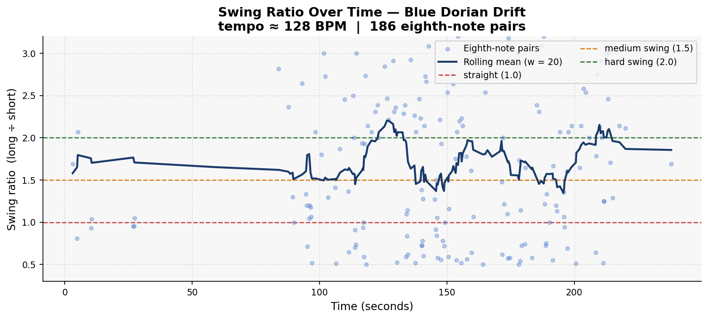
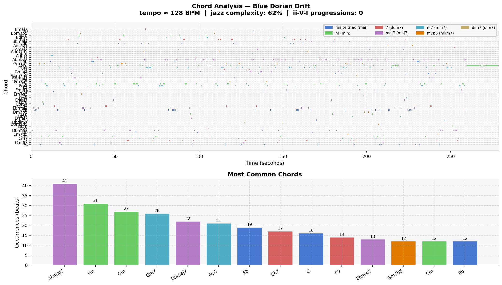

# Piece Report: Blue Dorian Drift

*Generated: 2026-06-13 12:53*

---

## Quick Stats

| Metric | Value |
| --- | --- |
| Tempo | 128 BPM |
| Detected key | Eb major |
| Swing ratio | 1.710  *(strong swing)* |
| Swing std dev | 0.894 |
| Jazz complexity | 63% |
| ii-V-I progressions | 0 |
| Unique chords | 58 |
| Jazz PC similarity | 0.941 |
| Harmonic complexity | 0.836 |
| Rubric total | **19/30** |

---

## AI Musical Assessment

The rhythmic character of "Blue Dorian Drift" exhibits a strong swing feel, largely indicated by a mean swing ratio of 1.710, positioning it between medium and hard swing. This implies a vigorous yet slightly relaxed rhythmic pulse that is characteristic of authentic jazz performance. However, the swing standard deviation of 0.894 suggests a considerable amount of expressive variation, which might add a sense of unpredictability and excitement but could also be perceived as rhythmic inconsistency if not carefully executed. While the tempo of 128 BPM sets a lively pace, aligning these rhythmic elements skillfully is critical for maintaining a cohesive groove.

From a harmonic perspective, the piece demonstrates moderate jazz sophistication, with 63% of the chords being seventh chords or richer, suggesting some jazz literacy. The absence of any ii-V-I progressions, however, is a significant departure from traditional jazz conventions, which typically rely on these progressions as foundational elements. The chord vocabulary, dominated by Abmaj7 and followed by a mix of minor and major triads, shows a lack of dominant seventh chords, which are vital for creating tension and resolution—a cornerstone of jazz harmony. Despite this, a high jazz pitch-class similarity of 0.941 indicates a close alignment with jazz tonal norms.

Overall, "Blue Dorian Drift" aligns most closely with modal jazz due to its emphasis on extended harmonies and absence of conventional progressions. One strength of the piece is its strong swing feel, which captures the rhythmic essence of jazz despite its deviation from classical form. However, a notable weakness is its lack of traditional ii-V-I progressions, which might limit its appeal to those who favor more conventional jazz harmonic structures. This experimental approach emphasizes a shift towards modern jazz expressions, suggesting potential for further exploration of harmonic depth and structural sophistication.

---

## Rhythmic Analysis

Mean swing ratio: **1.710** ± 0.894  
Valid eighth-note pairs analysed: **186**  

> Reference: 1.0 = straight · 1.5 = medium swing · 2.0 = hard swing / triplet feel

---

## Harmonic Analysis

**Jazz pitch-class similarity:** 0.941  
**Harmonic complexity (chroma entropy):** 0.836  
*(0 = single pitch class dominant; 1 = all 12 equally active)*

---

## Chord Vocabulary

| Chord | Quality | Beats | % of total |
| --- | --- | --- | --- |
| Abmaj7 | major 7th | 41 | 9.7% |
| Fm | minor triad | 31 | 7.4% |
| Gm | minor triad | 27 | 6.4% |
| Gm7 | minor 7th | 26 | 6.2% |
| Dbmaj7 | major 7th | 22 | 5.2% |
| Fm7 | minor 7th | 21 | 5.0% |
| Eb | major triad | 19 | 4.5% |
| Bb7 | dominant 7th | 17 | 4.0% |
| C | major triad | 16 | 3.8% |
| C7 | dominant 7th | 14 | 3.3% |

**Quality distribution:**

- major 7th                    █████ 28.3%
- minor triad                  ████ 20.2%
- major triad                  ███ 16.9%
- minor 7th                    ███ 16.4%
- dominant 7th                 ██ 11.2%
- half-diminished (m7b5)       █ 6.7%
- diminished 7th                0.5%

---

## Rubric Scores

**Rater:** Ryan · Grade 8 Rockschool jazz pianist · Listening date: 2026-06-13

| Axis | Score (1–5) | Visual |
| --- | --- | --- |
| Harmonic Authenticity | 4 | ■■■■□ |
| Swing Feel & Microtiming | 3 | ■■■□□ |
| Improvisational Coherence | 4 | ■■■■□ |
| Idiomatic Jazz Vocabulary | 3 | ■■■□□ |
| Ensemble Interaction | 3 | ■■■□□ |
| Formal Structure | 2 | ■■□□□ |
| **Total** | **19/30** | |

> Style shift at 1:34 modal→swing then back at 3:30. Macro-incoherent over 4 mins but micro-level sounds good. ii-V-Is present but tool missed them. A section only — no clear B section.

---

## Human Assessment

### Overall Impression

The chords do fit the tonal/modal intricacies of jazz. Some repetition of chord progression is able to be heard, defining clear sections, but there are some moments where it drifts off into new/random territories. There is a clear sectioning of the different parts and the timbre sounds pretty satisfactory. The swing feels consistent throughout the song, but over long periods of time can see a change. Overall, the microanalysis of the piece is very good, with shorter lengths of music sounding fine. But in the context of the entire 4-minute piece, there are inconsistencies with the style, swing ratio, chords and overall sectioning: at **1:34** the piece moves from open modal jazz to a more classic swing feel.

### Where I Agree / Disagree with the Automated Analysis

**ii-V-I count (tool says 0):** The chord table shows Fm7 → Bb7 → Eb and Gm7 → C7 → Fm7 present — the detector likely missed real progressions. The human ear clearly hears functional ii-V-I motion (e.g. Gm7 → C7 → Fm7, Fm7 → Bb7 → Eb). This is a finding about the limits of template-based automated detection on polyphonic audio.

**Swing ratio 1.71 ± 0.894:** The high variance reflects genuine inconsistency rather than expressive rubato — the stylistic break at 1:34 is a real, abrupt shift, not an interpretive choice. The number alone can't distinguish these; only the ear can.

**"Modal jazz" classification:** Partially agree. The Eb-centred maj7 vocabulary is consistent with a modal approach in the first half, but the piece doesn't commit — it shifts to more functional, cadential motion after 1:34, making it closer to tonal jazz that avoids cadences in its opening section rather than genuinely modal writing.

### Verdict

This song could fool a casual listener who isn't paying close attention — it works well as background music. However, the unpredictability and macro-incoherence might be confusing for some listeners. For a jazz musician, it would be quite easy to detect that it is not a strong representation of jazz: the incoherence at the sectional level, the unexplained style shift at 1:34, and the absence of committed formal structure would all be detectable as AI-generated.

*Full assessment: [results/notes/Blue Dorian Drift_assessment.md](../results/notes/Blue Dorian Drift_assessment.md)*

---

## References

- Rubric and methodology: [methodology.md](../methodology.md)
- Original prompts: [PROMPTS.md](../PROMPTS.md)
- Re-generate this report: `python analysis/generate_report.py --piece "Blue Dorian Drift"`