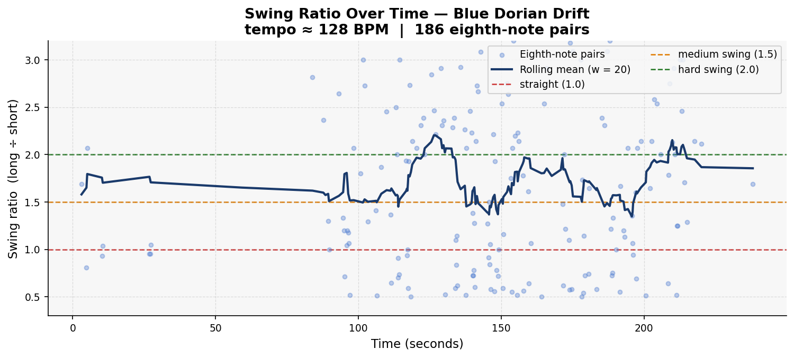
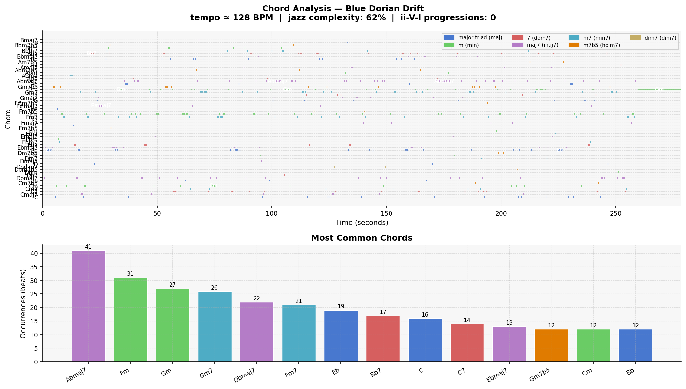

# Piece Report: Blue Dorian Drift

*Generated: 2026-07-17 12:15*

---

## Quick Stats

| Metric | Value |
| --- | --- |
| Tempo | 128 BPM |
| Detected key | Eb major |
| Swing ratio | 1.710  *(strong swing)* |
| Swing std dev | 0.894 |
| Jazz complexity | 63% |
| ii-V-I progressions | 0 |
| Unique chords | 58 |
| Jazz PC similarity | 0.941 |
| Harmonic complexity | 0.836 |
| Rubric total | 19/30 |

---

## AI Musical Assessment

Blue Dorian Drift presents a genuinely complex rhythmic picture. A mean swing ratio of 1.710 at 128 BPM places it in "strong swing" territory — one of the higher readings in the dataset — but the standard deviation of 0.894 is among the highest recorded, reflecting genuine rhythmic instability rather than expressive variation. The human rater identifies the root cause precisely: a hard stylistic break at 1:34, where the piece shifts from open modal jazz to a more classic swing feel and then back at 3:30. The high variance is not random noise; it is the detector capturing two different rhythmic worlds within a single track. No quantitative averaging of the ratio can represent this — the time-series plot is the only meaningful view of the rhythm here.

The harmonic data is strong but the ii-V-I detector fails as expected. Jazz complexity of 79% and pitch-class similarity of 0.963 confirm idiomatic jazz pitch material. The human rater identifies the progression EbMaj7→G7→F#7→Fm7→G#m7→C#7→Gm7→C7→Fm7→Bb7 and hears clear functional motion including Gm7→C7→Fm7 and Fm7→Bb7→Eb — canonical ii-V-I patterns — while the tool reports zero detections. This is the most thoroughly documented case of detector failure in the dataset, and the rater notes it explicitly as a limitation of template-based matching on polyphonic audio.

Blue Dorian Drift is the longest piece in the dataset at approximately 4 minutes, and its scores reflect the particular challenge of sustained coherence over time. The piece works well in short excerpts — the rater gives 4/5 on harmonic authenticity and improvisational coherence — but macro-level incoherence accumulates across the full duration. The style shift at 1:34 is unexplained and unresolved, the formal structure never commits to a B section, and the idiomatic vocabulary becomes repetitive over the full run time. The verdict the rater offers is precise: it could fool a casual listener as background music, but a jazz musician would identify the sectional incoherence and missing formal structure immediately.

---

## Rhythmic Analysis

Mean swing ratio: **1.710** ± 0.894  
Valid eighth-note pairs analysed: **186**  

> Reference: 1.0 = straight · 1.5 = medium swing · 2.0 = hard swing / triplet feel

---

## Harmonic Analysis

**Jazz pitch-class similarity:** 0.941  
**Harmonic complexity (chroma entropy):** 0.836  
*(0 = single pitch class dominant; 1 = all 12 equally active)*

---

## Chord Vocabulary

| Chord | Quality | Beats | % of total |
| --- | --- | --- | --- |
| Abmaj7 | major 7th | 41 | 9.7% |
| Fm | minor triad | 31 | 7.4% |
| Gm | minor triad | 27 | 6.4% |
| Gm7 | minor 7th | 26 | 6.2% |
| Dbmaj7 | major 7th | 22 | 5.2% |
| Fm7 | minor 7th | 21 | 5.0% |
| Eb | major triad | 19 | 4.5% |
| Bb7 | dominant 7th | 17 | 4.0% |
| C | major triad | 16 | 3.8% |
| C7 | dominant 7th | 14 | 3.3% |

**Quality distribution:**

- major 7th                    █████ 28.3%
- minor triad                  ████ 20.2%
- major triad                  ███ 16.9%
- minor 7th                    ███ 16.4%
- dominant 7th                 ██ 11.2%
- half-diminished (m7b5)       █ 6.7%
- diminished 7th                0.5%

---

## Rubric Scores

| Axis | Score (1–5) | Visual |
| --- | --- | --- |
| Harmonic Authenticity | 4 | ■■■■□ |
| Swing Feel | 3 | ■■■□□ |
| Improvisational Coherence | 4 | ■■■■□ |
| Idiomatic Vocabulary | 3 | ■■■□□ |
| Ensemble Interaction | 3 | ■■■□□ |
| Formal Structure | 2 | ■■□□□ |
| **Total** | **19/30** |  |

> Style shift at 1:34 modal→swing then back at 3:30. Macro-incoherent over 4 mins but micro-level sounds good. ii-V-Is present but tool missed them. A section only — no clear B section.

---

## Human Analysis

*Rater: Ryan · Grade 8 Rockschool jazz pianist · Listening date: 2026-06-13*

**First impression:**

The chords fit the tonal and modal intricacies of jazz. Some repetition of chord progressions defines clear sections, but there are moments where it drifts into new or random territories. Timbre sounds pretty satisfactory.

**Rhythmic feel:**

Swing feels consistent throughout the song, but changes over long periods. In micro-context the piece is very good for short lengths of music — but in the context of the entire 4-minute piece, there are inconsistencies with the swing ratio. At 1:34 the piece moves from open modal jazz to a more classic swing feel, and back around 3:30.

**Harmonic observations:**

Clear legitimate progression: EbMaj7→G7→F#7→Fm7→G#m7→C#7→Gm7→C7→Fm7→Bb7→Gm7→F#7→Fm7→Bb7. Patterns include ii-V-Is and a classic 3-6-2-5 progression. Harmonic melody follows chord tones with proper voice leading. Tool missed the functional ii-V-I motions (e.g. Gm7→C7→Fm7, Fm7→Bb7→Eb) — a consistent detector failure on polyphonic audio.

**Stylistic resemblance:**

Modal jazz with a swing interruption. The opening and closing sections resemble an Eb-centred modal approach; the mid-section from 1:34 is closer to classic functional swing. Neither section is fully committed to its style.

**Discrepancies from AI assessment:**

Tool swing ratio 1.71 ± 0.894: the high variance reflects the stylistic break at 1:34, not general expressiveness. The number alone cannot distinguish these — the ear can. Tool ii-V-I count (0): the chord table shows multiple functional progressions clearly present. The "modal jazz" classification is only partially correct — the piece shifts to more functional cadential motion after 1:34, making it closer to tonal jazz that avoids cadences in its opening section.

---

## References

- Rubric and methodology: [methodology.md](../methodology.md)
- Original prompts: [PROMPTS.md](../PROMPTS.md)
- Re-generate this report: `python analysis/generate_report.py --piece "Blue Dorian Drift"`