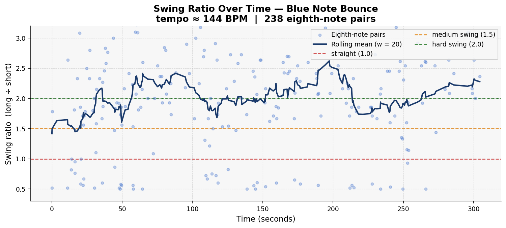
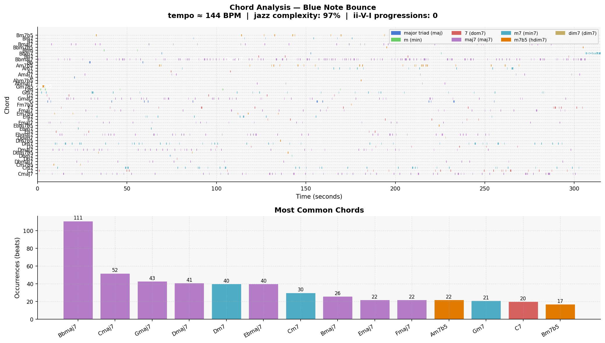

# Piece Report: Blue Note Bounce

*Generated: 2026-06-13 12:53*

---

## Quick Stats

| Metric | Value |
| --- | --- |
| Tempo | 144 BPM |
| Detected key | G minor |
| Swing ratio | 2.014  *(hard swing / triplet feel)* |
| Swing std dev | 0.870 |
| Jazz complexity | 97% |
| ii-V-I progressions | 0 |
| Unique chords | 47 |
| Jazz PC similarity | 0.965 |
| Harmonic complexity | 0.947 |
| Rubric total | *(not rated)* |

---

## AI Musical Assessment

"Blue Note Bounce" exhibits a dynamic rhythmic character, driven primarily by its hard swing feel, as indicated by a mean swing ratio of 2.014. This suggests a pronounced triplet feel that is quintessential to achieving an authentic swing groove. However, the high swing standard deviation of 0.870 indicates considerable variability, perhaps contributing to an expressiveness that may sometimes feel inconsistent or erratic rather than naturally fluid. This could impact the overall coherence of the piece, but it also offers a distinct liveliness that may appeal in a live setting, where unpredictability can charm audiences.

From a harmonic standpoint, "Blue Note Bounce" displays an impressive level of complexity, with 97% of the beats featuring 7th-or-richer chords. Its harmonic palette leans heavily on major 7th chords, comprising 58% of the progression, which, while lush, can lead to monotony without the tension usually provided by more ii-V-I sequences, which are notably absent here. This suggests a level of jazz literacy through complexity and the use of rich voicings; however, the lack of traditional ii-V-I resolutions might feel ungrounded to purists expecting more conventional progression techniques.

Overall, "Blue Note Bounce" leans towards a modern jazz style that emphasizes harmonic richness over traditional progression structures. The piece's strength resides in its sophisticated chordal fabric and adherence to jazz's harmonic roots, as evidenced by a high jazz pitch-class similarity score of 0.965. However, the absence of ii-V-I progressions and variable swing articulation might detract from its accessibility and cohesion, suggesting room for refining the balance between harmonic ambition and rhythmic stability.

---

## Rhythmic Analysis

Mean swing ratio: **2.014** ± 0.870  
Valid eighth-note pairs analysed: **238**  

> Reference: 1.0 = straight · 1.5 = medium swing · 2.0 = hard swing / triplet feel

---

## Harmonic Analysis

**Jazz pitch-class similarity:** 0.965  
**Harmonic complexity (chroma entropy):** 0.947  
*(0 = single pitch class dominant; 1 = all 12 equally active)*

---

## Chord Vocabulary

| Chord | Quality | Beats | % of total |
| --- | --- | --- | --- |
| Bbmaj7 | major 7th | 111 | 16.7% |
| Cmaj7 | major 7th | 52 | 7.8% |
| Gmaj7 | major 7th | 43 | 6.5% |
| Dmaj7 | major 7th | 41 | 6.2% |
| Dm7 | minor 7th | 40 | 6.0% |
| Ebmaj7 | major 7th | 40 | 6.0% |
| Cm7 | minor 7th | 30 | 4.5% |
| Bmaj7 | major 7th | 26 | 3.9% |
| Emaj7 | major 7th | 22 | 3.3% |
| Fmaj7 | major 7th | 22 | 3.3% |

**Quality distribution:**

- major 7th                    ███████████ 57.7%
- minor 7th                    ████ 20.6%
- dominant 7th                 █ 9.8%
- half-diminished (m7b5)       █ 8.4%
- major triad                  █ 2.3%
- minor triad                   1.1%
- diminished 7th                0.2%

---

## Rubric Scores

*Not yet rated. Run `rating_helper.py` to score this piece.*

---

## References

- Rubric and methodology: [methodology.md](../methodology.md)
- Original prompts: [PROMPTS.md](../PROMPTS.md)
- Re-generate this report: `python analysis/generate_report.py --piece "Blue Note Bounce"`