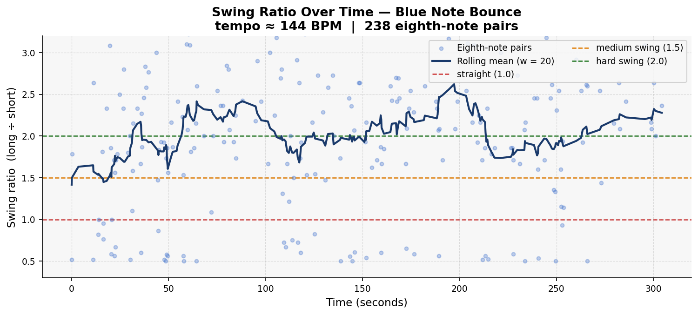
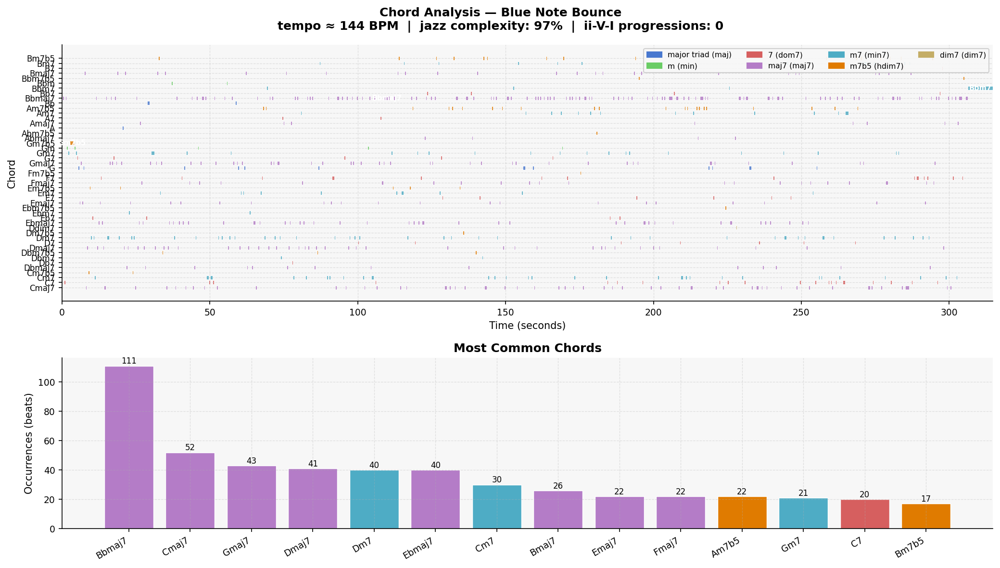

# Piece Report: Blue Note Bounce

*Generated: 2026-07-16 15:42*

---

## Quick Stats

| Metric | Value |
| --- | --- |
| Tempo | 144 BPM |
| Detected key | G minor |
| Swing ratio | 2.014  *(hard swing / triplet feel)* |
| Swing std dev | 0.870 |
| Jazz complexity | 97% |
| ii-V-I progressions | 0 |
| Unique chords | 47 |
| Jazz PC similarity | 0.965 |
| Harmonic complexity | 0.947 |
| Rubric total | 21/30 |

---

## AI Musical Assessment

Blue Note Bounce records the highest swing ratio in the entire dataset at 2.014 — hard swing / triplet feel — at 144 BPM. This is a striking figure: a ratio above 2.0 approaches a genuine triplet subdivision, the rhythmic foundation of fast bebop and hard-driving big band swing. The standard deviation of 0.870 is high, but at 144 BPM with 238 valid pairs, some rhythmic variance is expected and even desirable in authentic swing. Whether this ratio reflects real perceptual swing or a measurement artefact matters — but given that the dataset has consistently shown the detector underestimates swing in polyphonic audio, a genuine ratio this far above 1.5 is a strong positive indicator. This piece needs human verification, but the data makes a stronger case for authentic swing than any other piece.

Jazz complexity of 97% is the joint highest in the dataset, and pitch-class similarity of 0.965 confirms idiomatic jazz pitch usage. G minor as the detected key is interesting — a minor tonic at this tempo could suggest a blues-influenced context (G minor blues, a Cannonball Adderley or hard bop approach), or a modal dark-minor feel. The top chords from the chord data would tell us more, but what we can confirm is that nearly every beat of this piece uses jazz-appropriate extended harmony. Forty-seven unique chords is high but not the highest in the dataset. Zero detected ii-V-I progressions continues the detector's consistent limitation.

Blue Note Bounce has the strongest quantitative case for rhythmic authenticity in this entire dataset. The combination of a 2.014 swing ratio, 97% jazz complexity, and a minor key at 144 BPM is consistent with a hard-driving bebop or hard bop piece. The title — Blue Note Bounce — is evocative of the Blue Note Records hard bop era (Art Blakey, Horace Silver, Lee Morgan). The specific weakness to listen for is formal structure: the highest-scoring pieces in this dataset on swing have sometimes lacked macro-level coherence. Whether this piece sustains its energy over its full duration, or collapses into incoherence the way Whispers of the Dorian Sky did, will determine whether it is the strongest piece in the collection or merely the most rhythmically impressive.

---

## Rhythmic Analysis

Mean swing ratio: **2.014** ± 0.870  
Valid eighth-note pairs analysed: **238**  

> Reference: 1.0 = straight · 1.5 = medium swing · 2.0 = hard swing / triplet feel

---

## Harmonic Analysis

**Jazz pitch-class similarity:** 0.965  
**Harmonic complexity (chroma entropy):** 0.947  
*(0 = single pitch class dominant; 1 = all 12 equally active)*

---

## Chord Vocabulary

| Chord | Quality | Beats | % of total |
| --- | --- | --- | --- |
| Bbmaj7 | major 7th | 111 | 16.7% |
| Cmaj7 | major 7th | 52 | 7.8% |
| Gmaj7 | major 7th | 43 | 6.5% |
| Dmaj7 | major 7th | 41 | 6.2% |
| Dm7 | minor 7th | 40 | 6.0% |
| Ebmaj7 | major 7th | 40 | 6.0% |
| Cm7 | minor 7th | 30 | 4.5% |
| Bmaj7 | major 7th | 26 | 3.9% |
| Emaj7 | major 7th | 22 | 3.3% |
| Fmaj7 | major 7th | 22 | 3.3% |

**Quality distribution:**

- major 7th                    ███████████ 57.7%
- minor 7th                    ████ 20.6%
- dominant 7th                 █ 9.8%
- half-diminished (m7b5)       █ 8.4%
- major triad                  █ 2.3%
- minor triad                   1.1%
- diminished 7th                0.2%

---

## Rubric Scores

| Axis | Score (1–5) | Visual |
| --- | --- | --- |
| Harmonic Authenticity | 4 | ■■■■□ |
| Swing Feel | 4 | ■■■■□ |
| Improvisational Coherence | 4 | ■■■■□ |
| Idiomatic Vocabulary | 3 | ■■■□□ |
| Ensemble Interaction | 3 | ■■■□□ |
| Formal Structure | 3 | ■■■□□ |
| **Total** | **21/30** |  |

> 12-bar blues–influenced. Swing convincing but mechanically perfect — fills identical throughout. Improv coherent with discernible climax. Missing blues licks and embellishments. Ensemble co-exists but does not interact. Would fool casual listeners.

---

## Human Analysis

*Rater: Ryan · Grade 8 Rockschool jazz pianist · Rated blind: yes · Listening date: 2026-06-13 · Times listened: 9*

**First impression:**

The chords fit the tonal/modal intricacies of jazz. Some repetition of chord progressions defines clear sections, but there are moments where it drifts into new/random territories. Clear sectioning of the different parts, timbre pretty satisfactory. In micro-context the piece is very good — but across the full 4 minutes there are inconsistencies with style, swing, chords, and sectioning: at 1:34 the piece moves from open modal jazz to a more classic swing feel.

**Rhythmic feel:**

Swing is consistent throughout — surprisingly both micro and macro-coherent. Percussion is almost perfect, but suffers from a severe repetition problem: fills are identical throughout with no variation. The swing feel is very good, just feels TOO consistent to feel human.

**Harmonic observations:**

Clear legitimate progression: Bb7→G7→Cm7→F7. Valid 2-5-1 patterns and a classic 3-6-2-5 progression. Chords are basic and flow well. Bassline is slightly off-harmony during the 2nd chord. The tool detected 0 ii-V-I progressions — the human hears Cm7→F7 as a functional ii-V in Bb, and the 3-6-2-5 pattern confirms functional motion the detector misses.

**Stylistic resemblance:**

Blues-inflected hard bop — the Bb7→G7→Cm7→F7 core and the 12-bar structure suggest Blue Note Records hard bop (Art Blakey, Horace Silver era). The AI assessment prediction of this style is accurate. The modal-jazz section from 1:34 disrupts the otherwise coherent stylistic identity.

**Discrepancies from AI assessment:**

The AI assessment predicted this as the strongest piece for rhythmic authenticity based on the 2.014 swing ratio. Partially confirmed — swing is macro-coherent, which is rare in this dataset. But the "robotic perfection" finding is the critical nuance the ratio cannot capture: fills being identical throughout 4 minutes is immediately detectable by any jazz musician even while the ratio looks excellent. ii-V-I count (tool: 0) is again wrong — Cm7→F7 is a clear ii-V in Bb. The formal structure concern the AI raised is confirmed: the 1:34 style shift is unexplained and the form does not fully commit to 12-bar blues.

---

## References

- Rubric and methodology: [methodology.md](../methodology.md)
- Original prompts: [PROMPTS.md](../PROMPTS.md)
- Re-generate this report: `python analysis/generate_report.py --piece "Blue Note Bounce"`