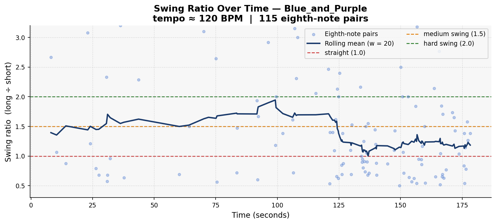
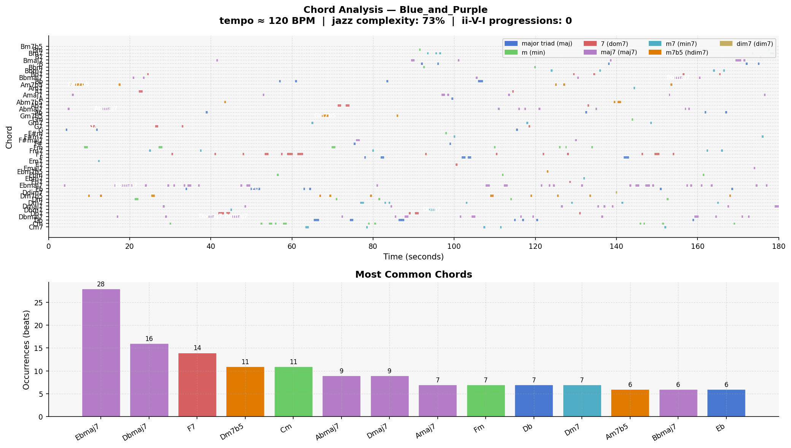

# Piece Report: Blue_and_Purple

*Generated: 2026-07-17 11:29*

---

## Quick Stats

| Metric | Value |
| --- | --- |
| Tempo | 120 BPM |
| Detected key | Eb major |
| Swing ratio | 1.358  *(medium swing)* |
| Swing std dev | 0.747 |
| Jazz complexity | 72% |
| ii-V-I progressions | 0 |
| Unique chords | 53 |
| Jazz PC similarity | 0.934 |
| Harmonic complexity | 0.841 |
| Rubric total | 20/30 |

---

## AI Musical Assessment

Blue and Purple sits at 120 BPM in Eb major with a swing ratio of 1.358 — the tool classifies this as medium swing, and with a standard deviation of 0.747 the feel is genuinely variable rather than locked in. At this tempo a medium-swing feel is achievable but not guaranteed, and the high variance suggests the swing is inconsistent across the piece rather than expressively flexible. For context, this is one of the more rhythmically convincing ratios in the dataset on paper, though the number alone cannot confirm whether the groove is carried by the rhythm section or is simply an artefact of onset spacing.

The harmonic picture is mixed. Jazz complexity of 72% is moderate — a meaningful portion of the piece uses triads or simpler harmonies, pulling the sophistication below most other pieces in this dataset. Pitch-class similarity of 0.934 and harmonic complexity of 0.841 indicate reasonable jazz vocabulary overall, but 53 unique chords is very high for a piece of this length — higher than all but one other piece — and zero detected ii-V-I progressions confirms the detector's now-familiar limitation on polyphonic audio. The top chords (Ebmaj7, Dbmaj7, F7, Dm7b5, Cm, Abmaj7) span at least three tonal centres with no visible logic connecting them: Dm7b5 and Dbmaj7 side by side suggests chromatic substitution at best, random motion at worst.

Blue and Purple has more tonal ambiguity than most pieces in this evaluation, with the highest unique chord count in the dataset and only moderate jazz complexity. If the swing holds up on listening it may be one of the more rhythmically engaging pieces; harmonically it appears to wander. The Eb major detection and heavy use of flat-side chords (Db, Ab) suggests a consistent palette at least, even if the functional logic within that palette is unclear. This piece warrants careful human listening to determine whether the high chord count reflects creative chromaticism or simply harmonic incoherence.

---

## Rhythmic Analysis

Mean swing ratio: **1.358** ± 0.747  
Valid eighth-note pairs analysed: **115**  

> Reference: 1.0 = straight · 1.5 = medium swing · 2.0 = hard swing / triplet feel

---

## Harmonic Analysis

**Jazz pitch-class similarity:** 0.934  
**Harmonic complexity (chroma entropy):** 0.841  
*(0 = single pitch class dominant; 1 = all 12 equally active)*

---

## Chord Vocabulary

| Chord | Quality | Beats | % of total |
| --- | --- | --- | --- |
| Ebmaj7 | major 7th | 28 | 11.2% |
| Dbmaj7 | major 7th | 16 | 6.4% |
| F7 | dominant 7th | 14 | 5.6% |
| Dm7b5 | half-diminished (m7b5) | 11 | 4.4% |
| Cm | minor triad | 11 | 4.4% |
| Abmaj7 | major 7th | 9 | 3.6% |
| Dmaj7 | major 7th | 9 | 3.6% |
| Amaj7 | major 7th | 7 | 2.8% |
| Fm | minor triad | 7 | 2.8% |
| Db | major triad | 7 | 2.8% |

**Quality distribution:**

- major 7th                    ██████ 33.5%
- major triad                  ██ 14.7%
- dominant 7th                 ██ 14.3%
- minor 7th                    ██ 14.3%
- minor triad                  ██ 13.1%
- half-diminished (m7b5)       █ 9.6%
- diminished 7th                0.4%

---

## Rubric Scores

| Axis | Score (1–5) | Visual |
| --- | --- | --- |
| Harmonic Authenticity | 4 | ■■■■□ |
| Swing Feel | 3 | ■■■□□ |
| Improvisational Coherence | 3 | ■■■□□ |
| Idiomatic Vocabulary | 3 | ■■■□□ |
| Ensemble Interaction | 5 | ■■■■■ |
| Formal Structure | 2 | ■■□□□ |
| **Total** | **20/30** |  |

> Lush extensions with good voice leading. Timbre slightly off. Ensemble interaction perfect (piano response at 2:04). Swing inconsistent. Structure weak. Passes as ambient jazz.

---

## Human Analysis

*Rater: Ryan · Grade 8 Rockschool jazz pianist · Listening date: 2026-06-13 · Times listened: 12*

**First impression:**

Timbre is slightly off with some melodies. The vibe is proper with a high level of interaction — piano response clearly audible at 2:04.

**Rhythmic feel:**

The swing isn't strongly felt and microtiming can be a little off in places. However it is consistent throughout and the percussion is almost perfect.

**Harmonic observations:**

The chords are the leading factor here — lush extensions that move into each other properly, with voice leading playing an important role. This is the strongest harmonic axis in the piece.

**Stylistic resemblance:**

Slow/mid-tempo jazz with a lush ballad-adjacent feel. The strong ensemble interaction and chord extensions evoke a Bill Evans trio or modal jazz context more than bebop.

**Discrepancies from AI assessment:**

The AI assessment flagged the high unique chord count (53) as potentially reflecting harmonic incoherence. The human assessment contradicts this: the chords score 4/5 for authenticity precisely because of their lush extensions and voice leading. The high count may reflect genuine harmonic richness rather than randomness. The AI assessment also could not predict the 5/5 ensemble interaction — the piano response at 2:04 is the defining feature of this piece and invisible to quantitative analysis.

---

## References

- Rubric and methodology: [methodology.md](../methodology.md)
- Original prompts: [PROMPTS.md](../PROMPTS.md)
- Re-generate this report: `python analysis/generate_report.py --piece "Blue_and_Purple"`