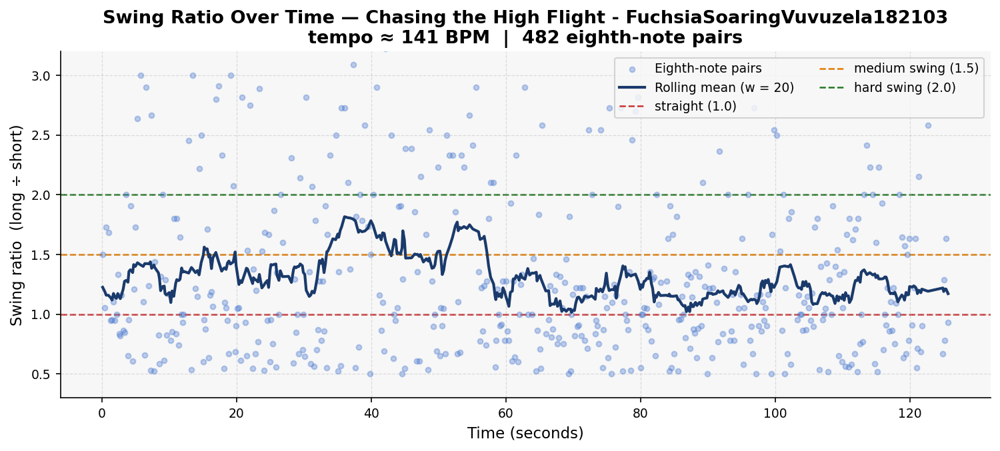
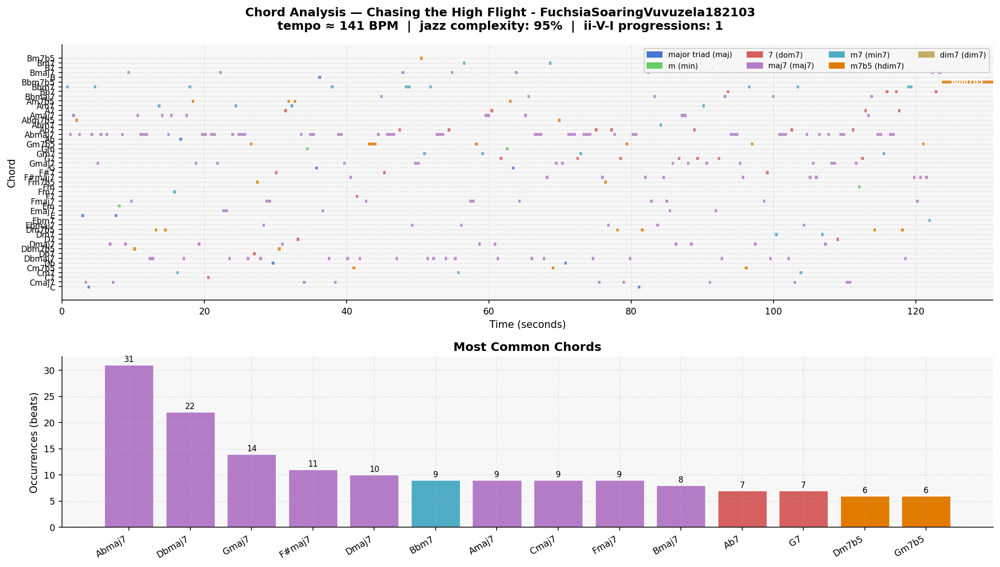

# Piece Report: Chasing the High Flight - FuchsiaSoaringVuvuzela182103

*Generated: 2026-06-13 12:53*

---

## Quick Stats

| Metric | Value |
| --- | --- |
| Tempo | 141 BPM |
| Detected key | F minor |
| Swing ratio | 1.302  *(medium swing)* |
| Swing std dev | 0.687 |
| Jazz complexity | 94% |
| ii-V-I progressions | 1 |
| Unique chords | 49 |
| Jazz PC similarity | 0.964 |
| Harmonic complexity | 0.906 |
| Rubric total | *(not rated)* |

---

## AI Musical Assessment

"Chasing the High Flight" sets off at an energetic tempo of 141 BPM, which should typically encourage a lively and driving rhythm. The detected mean swing ratio of 1.302 aligns with a medium swing, but the substantial swing standard deviation of 0.687 suggests considerable rhythmic variation. This rhythmic expressiveness can be seen as an effort to infuse the piece with spontaneity and human-like feel, attributes highly valued in jazz. However, such a high deviation may cause the swing feel to become inconsistent, potentially disrupting the overall groove and natural flow that typically characterizes an effective swinging jazz piece.

Harmonically, "Chasing the High Flight" demonstrates commendable complexity, with 94% of the chords incorporating 7th extensions or richer, which reflects a sophisticated level of jazz literacy. However, the absence of ii-V-I progressions is unconventional, given their fundamental role in jazz harmony. The predominance of major 7th chords like Abmaj7 and Dbmaj7 contributes to a lush but perhaps overly homogeneous harmonic landscape, lacking the tension and release that ii-V-I sequences traditionally provide. This piece exhibits a high jazz pitch-class similarity of 0.964, indicating a strong adherence to jazz harmonic norms despite its atypical progression choices.

In conclusion, "Chasing the High Flight" channels elements of modern jazz, characterized by both harmonic richness and a variable rhythmic feel. A specific strength is its harmonic density and jazz pitch alignment, contributing to a sonically rich piece. However, a notable weakness is its lack of traditional ii-V-I progressions, which might make it less accessible to listeners familiar with canonical jazz structures. Adjustments to its harmonic framework and swing consistency could enhance its stylistic impact and authenticity in the jazz genre.

---

## Rhythmic Analysis

Mean swing ratio: **1.302** ± 0.687  
Valid eighth-note pairs analysed: **482**  

> Reference: 1.0 = straight · 1.5 = medium swing · 2.0 = hard swing / triplet feel

---

## Harmonic Analysis

**Jazz pitch-class similarity:** 0.964  
**Harmonic complexity (chroma entropy):** 0.906  
*(0 = single pitch class dominant; 1 = all 12 equally active)*

---

## Chord Vocabulary

| Chord | Quality | Beats | % of total |
| --- | --- | --- | --- |
| Abmaj7 | major 7th | 31 | 12.9% |
| Dbmaj7 | major 7th | 22 | 9.2% |
| Gmaj7 | major 7th | 14 | 5.8% |
| F#maj7 | major 7th | 11 | 4.6% |
| Dmaj7 | major 7th | 10 | 4.2% |
| Bbm7 | minor 7th | 9 | 3.8% |
| Amaj7 | major 7th | 9 | 3.8% |
| Cmaj7 | major 7th | 9 | 3.8% |
| Fmaj7 | major 7th | 9 | 3.8% |
| Bmaj7 | major 7th | 8 | 3.3% |

**Quality distribution:**

- major 7th                    ███████████ 57.9%
- dominant 7th                 ██ 12.9%
- minor 7th                    ██ 12.1%
- half-diminished (m7b5)       ██ 11.2%
- major triad                  █ 4.2%
- minor triad                   1.7%

---

## Rubric Scores

*Not yet rated. Run `rating_helper.py` to score this piece.*

---

## References

- Rubric and methodology: [methodology.md](../methodology.md)
- Original prompts: [PROMPTS.md](../PROMPTS.md)
- Re-generate this report: `python analysis/generate_report.py --piece "Chasing the High Flight - FuchsiaSoaringVuvuzela182103"`