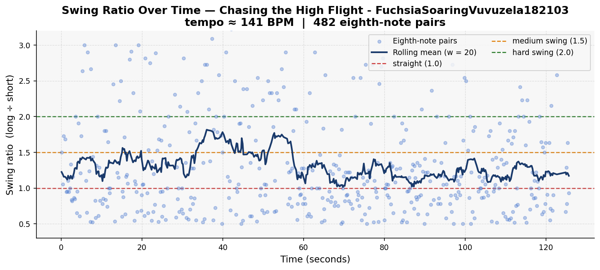
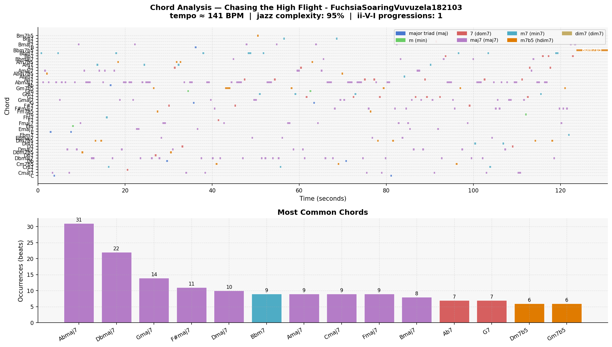

# Piece Report: Chasing the High Flight - FuchsiaSoaringVuvuzela182103

*Generated: 2026-07-17 11:42*

---

## Quick Stats

| Metric | Value |
| --- | --- |
| Tempo | 141 BPM |
| Detected key | F minor |
| Swing ratio | 1.302  *(medium swing)* |
| Swing std dev | 0.687 |
| Jazz complexity | 94% |
| ii-V-I progressions | 1 |
| Unique chords | 49 |
| Jazz PC similarity | 0.964 |
| Harmonic complexity | 0.906 |
| Rubric total | 13/30 |

---

## AI Musical Assessment

Chasing the High Flight registers a swing ratio of 1.302 at 141 BPM — medium swing, which at this tempo is a reasonable result. The standard deviation of 0.687 is moderate, suggesting some rhythmic inconsistency but not the extreme instability seen in pieces like Blue Dorian Drift or The Flaming Band. With 482 valid pairs — one of the highest counts in the dataset — this is a statistically reliable measurement, giving more confidence in the medium-swing classification than most pieces. The known detector bias suggests the perceptual swing may be stronger than 1.302 implies, though the gap between detected and felt swing is likely smaller here than in the low-ratio pieces like Rail Yard Bop.

The harmonic profile is strong on paper. Jazz complexity of 94% and pitch-class similarity of 0.964 are both high, and this is the only piece in the new batch to register a detected ii-V-I progression (count: 1). While a single detection is modest, it confirms that at least one functional jazz cadence is present in a form the detector can recognise. F minor as the detected key gives a naturally jazz-appropriate tonal centre, and 49 unique chords at this tempo represents high harmonic density. The Udio-style filename suggests this is one of two Udio-generated pieces in the dataset alongside Whispers of the Dorian Sky, making direct comparison between the two Udio pieces methodologically interesting.

Chasing the High Flight presents the best quantitative case for harmonic sophistication among the Udio pieces, and the contrast with Whispers of the Dorian Sky will be telling. Where Whispers collapsed from coherent to chaotic within 55 seconds, the more reliable swing measurement and the detected ii-V-I progression here suggest a more consistent piece. The key human evaluation questions are: does the 141 BPM feel translate to genuine jazz energy, does the piece sustain its harmonic coherence over its full duration, and does the formal structure hold — the axis that most consistently exposes model limitations across this entire dataset.

---

## Rhythmic Analysis

Mean swing ratio: **1.302** ± 0.687  
Valid eighth-note pairs analysed: **482**  

> Reference: 1.0 = straight · 1.5 = medium swing · 2.0 = hard swing / triplet feel

---

## Harmonic Analysis

**Jazz pitch-class similarity:** 0.964  
**Harmonic complexity (chroma entropy):** 0.906  
*(0 = single pitch class dominant; 1 = all 12 equally active)*

---

## Chord Vocabulary

| Chord | Quality | Beats | % of total |
| --- | --- | --- | --- |
| Abmaj7 | major 7th | 31 | 12.9% |
| Dbmaj7 | major 7th | 22 | 9.2% |
| Gmaj7 | major 7th | 14 | 5.8% |
| F#maj7 | major 7th | 11 | 4.6% |
| Dmaj7 | major 7th | 10 | 4.2% |
| Bbm7 | minor 7th | 9 | 3.8% |
| Amaj7 | major 7th | 9 | 3.8% |
| Cmaj7 | major 7th | 9 | 3.8% |
| Fmaj7 | major 7th | 9 | 3.8% |
| Bmaj7 | major 7th | 8 | 3.3% |

**Quality distribution:**

- major 7th                    ███████████ 57.9%
- dominant 7th                 ██ 12.9%
- minor 7th                    ██ 12.1%
- half-diminished (m7b5)       ██ 11.2%
- major triad                  █ 4.2%
- minor triad                   1.7%

---

## Rubric Scores

| Axis | Score (1–5) | Visual |
| --- | --- | --- |
| Harmonic Authenticity | 2 | ■■□□□ |
| Swing Feel | 3 | ■■■□□ |
| Improvisational Coherence | 2 | ■■□□□ |
| Idiomatic Vocabulary | 3 | ■■■□□ |
| Ensemble Interaction | 2 | ■■□□□ |
| Formal Structure | 1 | ■□□□□ |
| **Total** | **13/30** |  |

> No chord progression despite correct individual notes. Percussion static throughout — zero call-and-response. Solo sporadic and random. No structure. Detectable as AI by most listeners.

---

## Human Analysis

*Rater: Ryan · Grade 8 Rockschool jazz pianist · Listening date: 2026-06-13 · Times listened: 6*

**First impression:**

Just feels quite random, with no long-term structural sense. In short bursts it can sound okay, but in the context of the whole piece it just doesn't work at all.

**Rhythmic feel:**

Swing is consistent in a micro-context but feels variable across the whole song. No evolution or adaptation in the percussion — static throughout.

**Harmonic observations:**

There is essentially no chord progression, even though the individual harmonic notes throughout are correct. The pieces are present but not assembled into anything functional.

**Stylistic resemblance:**

Difficult to place in a specific substyle — the randomness prevents any clear stylistic identity from forming.

**Discrepancies from AI assessment:**

The AI assessment was optimistic, predicting this as the stronger of the two Udio pieces with sustained coherence. The opposite is true: the 94% jazz complexity and single detected ii-V-I look convincing in the data, but the individual notes are correct while the progression is absent — a distinction the quantitative tools cannot make. The percussion being static throughout (zero call-and-response) is invisible to the chord and swing detectors but is one of the most immediately obvious failure modes on listening. This is the clearest example in the dataset of strong quantitative metrics masking poor perceptual quality.

---

## References

- Rubric and methodology: [methodology.md](../methodology.md)
- Original prompts: [PROMPTS.md](../PROMPTS.md)
- Re-generate this report: `python analysis/generate_report.py --piece "Chasing the High Flight - FuchsiaSoaringVuvuzela182103"`