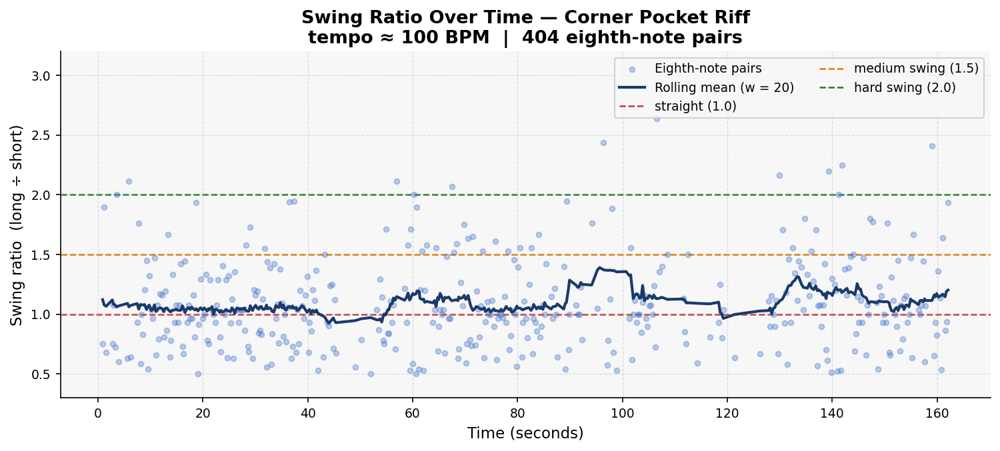
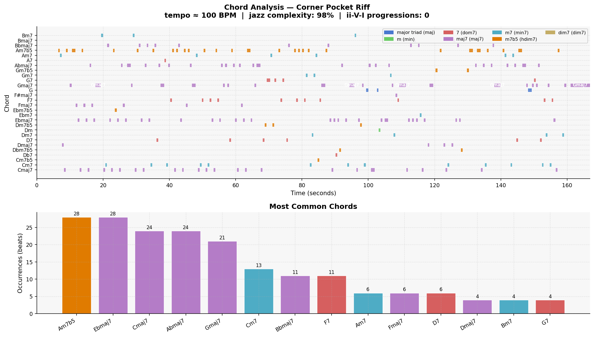

# Piece Report: Corner Pocket Riff

*Generated: 2026-06-13 12:54*

---

## Quick Stats

| Metric | Value |
| --- | --- |
| Tempo | 100 BPM |
| Detected key | G major |
| Swing ratio | 1.096  *(essentially straight — no swing feel)* |
| Swing std dev | 0.422 |
| Jazz complexity | 98% |
| ii-V-I progressions | 0 |
| Unique chords | 28 |
| Jazz PC similarity | 0.969 |
| Harmonic complexity | 0.966 |
| Rubric total | *(not rated)* |

---

## AI Musical Assessment

The rhythmic character of "Corner Pocket Riff" reveals a significant departure from traditional jazz feel. With a detected tempo of 100 BPM and a mean swing ratio of 1.096, the piece leans heavily toward a straight feel, devoid of the characteristic swing that defines many jazz styles. The swing standard deviation of 0.422 suggests some expressive variability, but not enough to infuse the piece with a true swing feel. As a result, listeners may find the groove lacks the propulsive, laid-back feel generally associated with classic jazz and particularly swinging subgenres like bebop or big band.

Harmonically, the piece demonstrates considerable sophistication, evidenced by a high jazz complexity rating of 98%. The prevalence of rich 7th-or-richer chords indicates a strong grasp of jazz harmony. However, the absence of traditional ii-V-I progressions—a hallmark of jazz harmony—suggests a deviation from established jazz structures. The top chords, including Am7b5, Ebmaj7, and Cmaj7, reflect an advanced vocabulary, though the prominent use of half-diminished chords and atypical cadences may pull the piece towards a more modern jazz sound. Notably, the jazz pitch-class similarity score of 0.969 shows a strong alignment with jazz norms, despite the unconventional progression sequences.

Overall, "Corner Pocket Riff" exhibits characteristics reminiscent of modern jazz or jazz fusion, which often embrace more exploratory harmonic landscapes with less traditional rhythmic feels. The piece's harmonic complexity is its standout strength, showcasing a mature understanding of rich jazz chordal textures. However, its rhythmic shortcoming—specifically the lack of a genuine swing feel—detracts from it aligning more closely with more traditional, swing-heavy jazz styles. This piece may appeal more to those interested in contemporary or fusion jazz approaches, where rhythmic and harmonic experimentation is more prevalent.

---

## Rhythmic Analysis

Mean swing ratio: **1.096** ± 0.422  
Valid eighth-note pairs analysed: **404**  

> Reference: 1.0 = straight · 1.5 = medium swing · 2.0 = hard swing / triplet feel

---

## Harmonic Analysis

**Jazz pitch-class similarity:** 0.969  
**Harmonic complexity (chroma entropy):** 0.966  
*(0 = single pitch class dominant; 1 = all 12 equally active)*

---

## Chord Vocabulary

| Chord | Quality | Beats | % of total |
| --- | --- | --- | --- |
| Am7b5 | half-diminished (m7b5) | 28 | 13.0% |
| Ebmaj7 | major 7th | 28 | 13.0% |
| Cmaj7 | major 7th | 24 | 11.1% |
| Abmaj7 | major 7th | 24 | 11.1% |
| Gmaj7 | major 7th | 21 | 9.7% |
| Cm7 | minor 7th | 13 | 6.0% |
| Bbmaj7 | major 7th | 11 | 5.1% |
| F7 | dominant 7th | 11 | 5.1% |
| Am7 | minor 7th | 6 | 2.8% |
| Fmaj7 | major 7th | 6 | 2.8% |

**Quality distribution:**

- major 7th                    ███████████ 56.0%
- half-diminished (m7b5)       ███ 17.1%
- minor 7th                    ██ 14.4%
- dominant 7th                 ██ 10.6%
- major triad                   1.4%
- minor triad                   0.5%

---

## Rubric Scores

*Not yet rated. Run `rating_helper.py` to score this piece.*

---

## References

- Rubric and methodology: [methodology.md](../methodology.md)
- Original prompts: [PROMPTS.md](../PROMPTS.md)
- Re-generate this report: `python analysis/generate_report.py --piece "Corner Pocket Riff"`