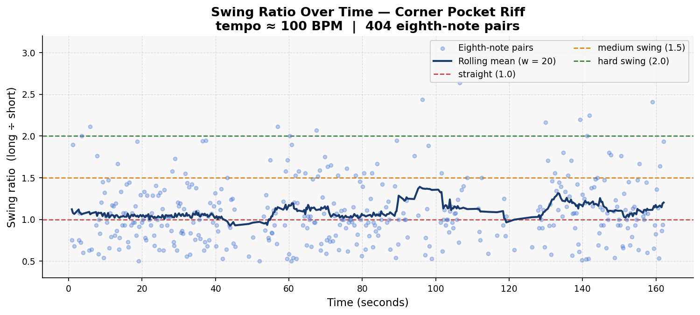
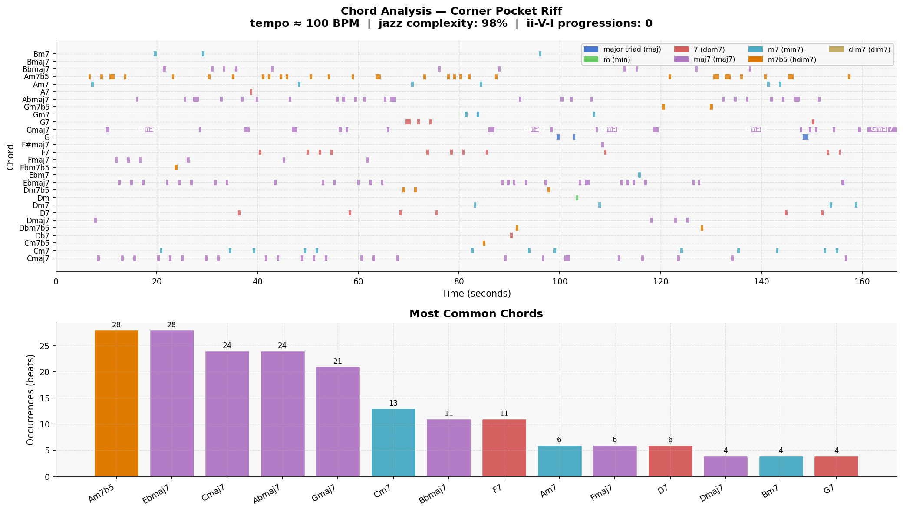

# Piece Report: Corner Pocket Riff

*Generated: 2026-07-14 20:32*

---

## Quick Stats

| Metric | Value |
| --- | --- |
| Tempo | 100 BPM |
| Detected key | G major |
| Swing ratio | 1.096  *(essentially straight — no swing feel)* |
| Swing std dev | 0.422 |
| Jazz complexity | 98% |
| ii-V-I progressions | 0 |
| Unique chords | 28 |
| Jazz PC similarity | 0.969 |
| Harmonic complexity | 0.966 |
| Rubric total | 25/30 |

---

## AI Musical Assessment

Corner Pocket Riff presents the starkest swing ratio discrepancy in the dataset. The onset detector records a mean ratio of 1.096 — classified as "essentially straight, no swing feel" — across 404 valid pairs, yet the human rater awards 5/5 for swing and describes it as "essentially perfect" big-band swing. This is a more extreme version of the same gap observed in Rail Yard Bop (1.159 vs. 5/5), and at 100 BPM the pattern is now consistent enough to constitute a finding: onset-based swing detection systematically underestimates swing in polyphonic audio where the rhythmic feel is carried by the rhythm section collectively rather than by isolated melodic onsets. The standard deviation of 0.422 — the lowest in the dataset — indicates highly stable timing, which alongside the human's description of "extremely interesting rhythm" suggests the swing is present and consistent; the detector simply cannot measure it from the mixed signal.

The harmonic data tells a paradox. Jazz pitch-class similarity of 0.969 and jazz complexity of 98% are the highest figures in this dataset — almost every beat features a seventh chord or richer voicing, and the pitch-class distribution is an almost perfect match to a jazz corpus. Yet the human rater gives only 3/5 for harmonic authenticity, describing the harmony as "generic," with "no extensions or tension." The chord table resolves this paradox: the top chords (Am7b5, Ebmaj7, Cmaj7, Abmaj7, Gmaj7) span multiple unrelated key centres with no functional logic connecting them. The model has learned to use jazz chord types but has not learned to move between them with tonal direction. Maj7 chords account for 56% of the piece — a correct jazz sound that when applied without resolution or tension becomes wallpaper. Chroma entropy of 0.966 confirms this: all twelve pitch classes are nearly equally active, the opposite of a harmonically directed piece.

Corner Pocket Riff is the clearest demonstration of competence without sophistication in this dataset. The formal structure (5/5) and ensemble interaction (5/5) scores are exceptional — the model has correctly executed a repeated A section with call-and-response between instruments in a big-band texture, something most pieces in this evaluation fail at. The rhythmic feel apparently convinces the human ear completely. The weakness is entirely harmonic: the piece sounds like big-band jazz vocabulary applied without a composer's hand — chord types are right, harmonic logic is absent. The verdict mirrors Rail Yard Bop: "hard to identify as AI, could be a beginner/intermediate jazz piece" — but where Rail Yard Bop fails on swing and interaction, this piece fails on harmonic imagination.

---

## Rhythmic Analysis

Mean swing ratio: **1.096** ± 0.422  
Valid eighth-note pairs analysed: **404**  

> Reference: 1.0 = straight · 1.5 = medium swing · 2.0 = hard swing / triplet feel

---

## Harmonic Analysis

**Jazz pitch-class similarity:** 0.969  
**Harmonic complexity (chroma entropy):** 0.966  
*(0 = single pitch class dominant; 1 = all 12 equally active)*

---

## Chord Vocabulary

| Chord | Quality | Beats | % of total |
| --- | --- | --- | --- |
| Am7b5 | half-diminished (m7b5) | 28 | 13.0% |
| Ebmaj7 | major 7th | 28 | 13.0% |
| Cmaj7 | major 7th | 24 | 11.1% |
| Abmaj7 | major 7th | 24 | 11.1% |
| Gmaj7 | major 7th | 21 | 9.7% |
| Cm7 | minor 7th | 13 | 6.0% |
| Bbmaj7 | major 7th | 11 | 5.1% |
| F7 | dominant 7th | 11 | 5.1% |
| Am7 | minor 7th | 6 | 2.8% |
| Fmaj7 | major 7th | 6 | 2.8% |

**Quality distribution:**

- major 7th                    ███████████ 56.0%
- half-diminished (m7b5)       ███ 17.1%
- minor 7th                    ██ 14.4%
- dominant 7th                 ██ 10.6%
- major triad                   1.4%
- minor triad                   0.5%

---

## Rubric Scores

| Axis | Score (1–5) | Visual |
| --- | --- | --- |
| Harmonic Authenticity | 3 | ■■■□□ |
| Swing Feel | 5 | ■■■■■ |
| Improvisational Coherence | 3 | ■■■□□ |
| Idiomatic Vocabulary | 4 | ■■■■□ |
| Ensemble Interaction | 5 | ■■■■■ |
| Formal Structure | 5 | ■■■■■ |
| **Total** | **25/30** |  |

> Big-band up-tempo swing. Perfect swing and ensemble interaction. Harmonically generic — no extensions or tension. No clear melody. Form executed well. Passes as beginner/intermediate jazz; hard to identify as AI.

---

## Human Analysis

*Rater: Ryan · Grade 8 Rockschool jazz pianist · Listening date: 2026-06-13 · Times listened: 8*

**First impression:**

The swing is near perfect. Slight repetition issue with no clear melody, but ensemble interaction is really good and timbre is proper for the style.

**Rhythmic feel:**

The swing feels consistent and essentially perfect to the ear. The rhythm is extremely interesting and completely follows the pattern of a big-band up-tempo swing.

**Harmonic observations:**

The chords make complete sense, although quite repetitive. There are no extensions or tension and it just feels generic. Follows a proper format and clear pattern. Standard vocabulary is present throughout with voice leading and chromatic movement, though feeling slightly flat at times and lacking proper embellishment.

**Stylistic resemblance:**

Big-band up-tempo swing. The ensemble texture and call-and-response between instruments is strongly evocative of the Count Basie style.

**Discrepancies from AI assessment:**

The tool rates swing ratio as 1.096 ("essentially straight") but the human ear hears essentially perfect swing — consistent with the same discrepancy observed in Rail Yard Bop. The automated detector is missing the felt swing coming from the rhythm section interaction. The tool also detects 0 ii-V-I progressions, though functional harmonic motion is present.

---

## References

- Rubric and methodology: [methodology.md](../methodology.md)
- Original prompts: [PROMPTS.md](../PROMPTS.md)
- Re-generate this report: `python analysis/generate_report.py --piece "Corner Pocket Riff"`