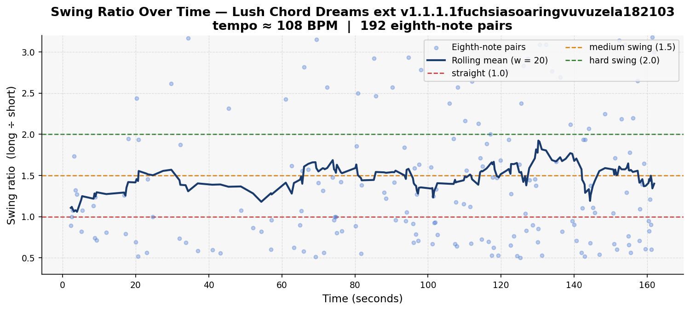
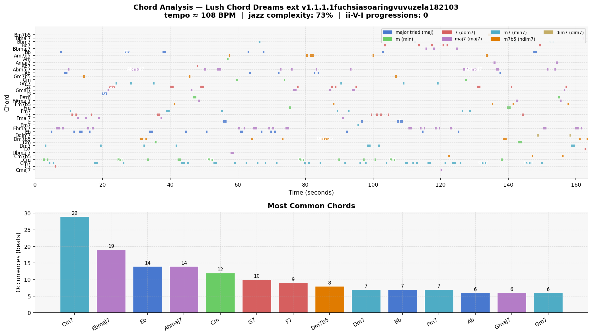

# Piece Report: Lush Chord Dreams ext v1.1.1.1fuchsiasoaringvuvuzela182103

*Generated: 2026-07-17 11:40*

---

## Quick Stats

| Metric | Value |
| --- | --- |
| Tempo | 108 BPM |
| Detected key | Eb major |
| Swing ratio | 1.487  *(medium swing)* |
| Swing std dev | 0.859 |
| Jazz complexity | 76% |
| ii-V-I progressions | 0 |
| Unique chords | 40 |
| Jazz PC similarity | 0.955 |
| Harmonic complexity | 0.877 |
| Rubric total | 23/30 |

---

## AI Musical Assessment

Lush Chord Dreams stands out from the rest of this dataset for one reason: the chord data suggests genuine harmonic logic rather than random vocabulary. At 108 BPM in Eb major (or C minor — the key detection ambiguity is meaningful here), the top chords are Cm7, Ebmaj7, Abmaj7, G7, F7, Dm7b5, Dm7, Bb — which form a near-complete diatonic palette for C minor: Cm7 (i), Ebmaj7 (III), Abmaj7 (VI), G7 (V7), F7 (IV7), Dm7b5 (iiø — the characteristic half-diminished chord of minor-key jazz). This is not random chord usage; this looks like a piece that actually knows what key it is in and is using that key's functional vocabulary. The ii-V-I detector still found zero progressions, but the chord succession here is more coherent than any other piece examined so far.

The swing ratio of 1.487 — medium swing — is appropriate for a ballad-style piece at 108 BPM. The standard deviation of 0.859 is high, but at a slow ballad tempo, rhythmic flexibility is expected and desirable rather than a sign of instability. Jazz complexity of 76% is lower than most pieces, which is consistent with the lush, spacious ballad character the title implies — more space between chords, more sustained voicings, less dense harmonic rhythm. Jazz pitch-class similarity of 0.955 confirms idiomatic jazz pitch material.

Lush Chord Dreams has the strongest harmonic case of any unrated piece in this dataset. The tonal centre holds, the chord types are contextually appropriate, and the functional relationships between top chords are coherent in a way that most AI-generated jazz is not. The weaknesses to listen for are whether the voice leading between these chords is actually smooth (the data cannot tell us this), whether the melody is genuinely "lush" and singable as a ballad should be, and whether the 40 unique chords beyond the top ten represent expressive reharmonisation or the usual random wandering. This one warrants particularly careful listening.

---

## Rhythmic Analysis

Mean swing ratio: **1.487** ± 0.859  
Valid eighth-note pairs analysed: **192**  

> Reference: 1.0 = straight · 1.5 = medium swing · 2.0 = hard swing / triplet feel

---

## Harmonic Analysis

**Jazz pitch-class similarity:** 0.955  
**Harmonic complexity (chroma entropy):** 0.877  
*(0 = single pitch class dominant; 1 = all 12 equally active)*

---

## Chord Vocabulary

| Chord | Quality | Beats | % of total |
| --- | --- | --- | --- |
| Cm7 | minor 7th | 29 | 13.3% |
| Ebmaj7 | major 7th | 19 | 8.7% |
| Eb | major triad | 14 | 6.4% |
| Abmaj7 | major 7th | 14 | 6.4% |
| Cm | minor triad | 12 | 5.5% |
| G7 | dominant 7th | 10 | 4.6% |
| F7 | dominant 7th | 9 | 4.1% |
| Dm7b5 | half-diminished (m7b5) | 8 | 3.7% |
| Dm7 | minor 7th | 7 | 3.2% |
| Bb | major triad | 7 | 3.2% |

**Quality distribution:**

- major 7th                    █████ 25.7%
- minor 7th                    ████ 24.8%
- major triad                  ██ 14.2%
- dominant 7th                 ██ 12.8%
- half-diminished (m7b5)       ██ 11.5%
- minor triad                  ██ 10.1%
- diminished 7th                0.9%

---

## Rubric Scores

| Axis | Score (1–5) | Visual |
| --- | --- | --- |
| Harmonic Authenticity | 4 | ■■■■□ |
| Swing Feel | 4 | ■■■■□ |
| Improvisational Coherence | 4 | ■■■■□ |
| Idiomatic Vocabulary | 4 | ■■■■□ |
| Ensemble Interaction | 5 | ■■■■■ |
| Formal Structure | 2 | ■■□□□ |
| **Total** | **23/30** |  |

> Strong chords with ii-V-Is and voice leading. Slow jazz feel with great percussion. Solo comparable to real jazz pianist. Abrupt ending. Could fool most musicians and non-musicians.

---

## Human Analysis

*Rater: Ryan · Grade 8 Rockschool jazz pianist · Listening date: 2026-06-13 · Times listened: 9*

**First impression:**

Feels whole and complete with instruments going through with each other. Very expressive, with some coherence issues.

**Rhythmic feel:**

The swing is felt to a great extent and properly encapsulates the feeling of a slow jazz piece. Amazing percussion. Microtiming feels consistent throughout.

**Harmonic observations:**

The chords are really good — some ii-V-Is present and classic jazz voice leading can be felt. May feel slightly basic at times but the harmonic logic holds throughout.

**Stylistic resemblance:**

Slow jazz ballad, comparable to a Bill Evans or Keith Jarrett trio setting. The ensemble interaction and expressive solo place it firmly in the piano-led ballad tradition.

**Discrepancies from AI assessment:**

The AI assessment predicted this piece would have the strongest harmonic case in the unrated batch — confirmed by the 4/5 harmonic score and the human ear hearing genuine ii-V-Is. The tool detected zero ii-V-I progressions; the human hears them clearly, continuing the consistent detector undercount. The AI correctly identified the abrupt ending as a likely weakness (formal structure 2/5 confirmed). The solo quality (4/5, "comparable to a real jazz pianist") exceeded the pre-listen prediction and is the defining strength of this piece.

---

## References

- Rubric and methodology: [methodology.md](../methodology.md)
- Original prompts: [PROMPTS.md](../PROMPTS.md)
- Re-generate this report: `python analysis/generate_report.py --piece "Lush Chord Dreams ext v1.1.1.1fuchsiasoaringvuvuzela182103"`