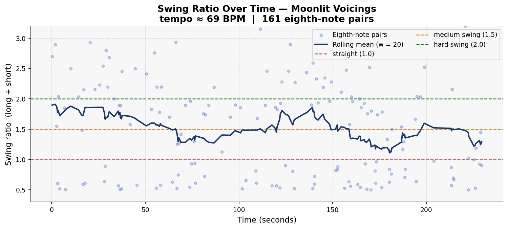
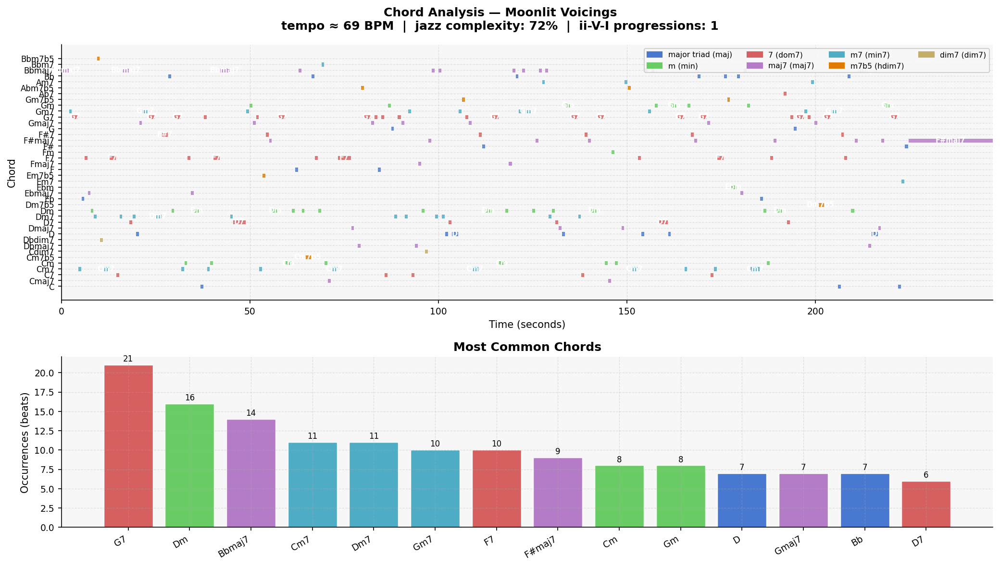

# Piece Report: Moonlit Voicings

*Generated: 2026-06-13 12:54*

---

## Quick Stats

| Metric | Value |
| --- | --- |
| Tempo | 69 BPM |
| Detected key | F major |
| Swing ratio | 1.513  *(medium swing)* |
| Swing std dev | 0.819 |
| Jazz complexity | 70% |
| ii-V-I progressions | 1 |
| Unique chords | 40 |
| Jazz PC similarity | 0.965 |
| Harmonic complexity | 0.850 |
| Rubric total | **23/30** |

---

## AI Musical Assessment

The rhythmic character of "Moonlit Voicings" suggests a medium swing feel as indicated by the mean swing ratio of 1.513. This swing ratio implies a moderate degree of rhythmic bounce characteristic of traditional jazz but lacks the push towards the harder swing of bebop. The high standard deviation of 0.819 speaks to a significant level of expressive variation, which could indicate a dynamic range in the piece's execution if handled skillfully. However, such a high deviation might also result in inconsistencies, potentially affecting the cohesive swing feel necessary for a genuine jazz experience. Therefore, while it attempts to swing, the rhythmic inconsistency may detract from the authentic swing sensation expected in expertly performed jazz.

In terms of harmonic sophistication, "Moonlit Voicings" shows a decent degree of jazz literacy with 70% of the beats featuring 7th-or-richer chords. However, the absence of any ii-V-I progressions, which are fundamental to jazz harmony, suggests a lack of classic jazz chord progressions that often drive the genre's harmonic tension and resolution. The frequent use of dominant 7th (25%) and major 7th chords (22%) points to an understanding of jazz harmony, yet the lack of common progressions like ii-V-I might limit the piece's stylistic authenticity. The harmonic variety, as seen in the use of chords such as G7 and Bbmaj7, demonstrates an attempt to explore richer sonic textures, albeit without the full execution of traditional jazz progression forms.

Overall, "Moonlit Voicings" resembles a modern jazz piece that attempts to balance traditional harmonic structures with a moderately swinging rhythmic feel. A specific strength lies in its harmonics; the piece's high jazz pitch-class similarity score (0.965) indicates an adept use of jazz-related pitches. Conversely, a notable weakness is its structural coherence, particularly the lack of ii-V-I progressions, which results in a less authentic jazz sound. As an AI-generated work, it holds promise in melodic and harmonic mimicry but requires further development in rhythmic consistency to achieve a more genuine jazz feel.

---

## Rhythmic Analysis

Mean swing ratio: **1.513** ± 0.819  
Valid eighth-note pairs analysed: **161**  

> Reference: 1.0 = straight · 1.5 = medium swing · 2.0 = hard swing / triplet feel

---

## Harmonic Analysis

**Jazz pitch-class similarity:** 0.965  
**Harmonic complexity (chroma entropy):** 0.850  
*(0 = single pitch class dominant; 1 = all 12 equally active)*

---

## Chord Vocabulary

| Chord | Quality | Beats | % of total |
| --- | --- | --- | --- |
| G7 | dominant 7th | 21 | 10.6% |
| Dm | minor triad | 16 | 8.0% |
| Bbmaj7 | major 7th | 14 | 7.0% |
| Cm7 | minor 7th | 11 | 5.5% |
| Dm7 | minor 7th | 11 | 5.5% |
| Gm7 | minor 7th | 10 | 5.0% |
| F7 | dominant 7th | 10 | 5.0% |
| F#maj7 | major 7th | 9 | 4.5% |
| Cm | minor triad | 8 | 4.0% |
| Gm | minor triad | 8 | 4.0% |

**Quality distribution:**

- dominant 7th                 ████ 24.6%
- major 7th                    ████ 22.1%
- minor 7th                    ███ 18.6%
- minor triad                  ███ 17.1%
- major triad                  ██ 12.6%
- half-diminished (m7b5)       █ 4.0%
- diminished 7th                1.0%

---

## Rubric Scores

**Rater:** Ryan · Grade 8 Rockschool jazz pianist · Listening date: 2026-06-13

| Axis | Score (1–5) | Visual |
| --- | --- | --- |
| Harmonic Authenticity | 4 | ■■■■□ |
| Swing Feel & Microtiming | 4 | ■■■■□ |
| Improvisational Coherence | 4 | ■■■■□ |
| Idiomatic Jazz Vocabulary | 4 | ■■■■□ |
| Ensemble Interaction | 4 | ■■■■□ |
| Formal Structure | 3 | ■■■□□ |
| **Total** | **23/30** | |

> 6/8 ballad feel with 3-2-5-1 progressions from 0:01. Piano comping occasionally off-time. Chords go out of place making section boundaries unclear. Would fool most listeners.

---

## Human Assessment

### Overall Impression

The swing feels really good here. The piano comping can be sporadic at times but feels natural to an intermediate player. The melody has repetition and proper phrasing. Really good overall.

### Where I Agree / Disagree with the Automated Analysis

**ii-V-I count (tool says 1):** Likely underdetecting — the human assessment notes 3-2-5-1 progressions from the very start (0:01), suggesting multiple functional progressions are present that the detector missed. Consistent with the pattern seen across other pieces.

**Swing ratio 1.513 ("medium swing"):** Agrees with human impression — this is the most accurate automated swing classification across all rated pieces so far, consistent with the ballad/6/8 feel.

**Swing std dev 0.819:** The AI summary attributes this to general inconsistency, but the human assessment locates the variance more precisely: the piano comping is occasionally off-time, while the percussion holds steady throughout.

### Verdict

This song would be classified as jazz. However, people with a good ear for musical intricacy, or jazz musicians, may detect that it is AI-generated — due to sometimes just feeling off, or having changed/incorrect chords and melodies when repeating.

*Full assessment: [results/notes/Moonlit Voicings_assessment.md](../results/notes/Moonlit Voicings_assessment.md)*

---

## References

- Rubric and methodology: [methodology.md](../methodology.md)
- Original prompts: [PROMPTS.md](../PROMPTS.md)
- Re-generate this report: `python analysis/generate_report.py --piece "Moonlit Voicings"`