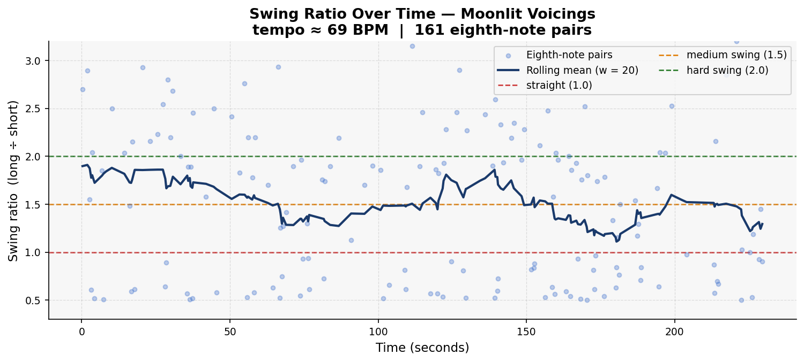
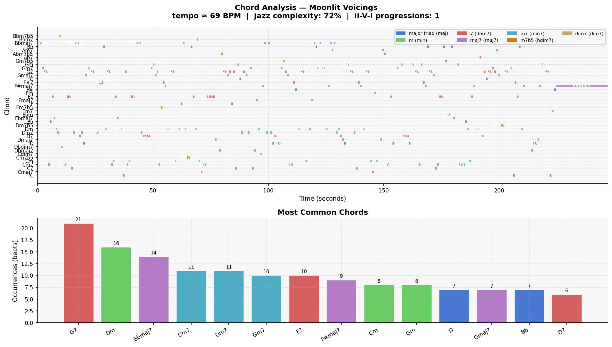

# Piece Report: Moonlit Voicings

*Generated: 2026-07-17 12:15*

---

## Quick Stats

| Metric | Value |
| --- | --- |
| Tempo | 69 BPM |
| Detected key | F major |
| Swing ratio | 1.513  *(medium swing)* |
| Swing std dev | 0.819 |
| Jazz complexity | 70% |
| ii-V-I progressions | 1 |
| Unique chords | 40 |
| Jazz PC similarity | 0.965 |
| Harmonic complexity | 0.850 |
| Rubric total | 23/30 |

---

## AI Musical Assessment

Moonlit Voicings is the slowest piece in the dataset at 69 BPM with a swing ratio of 1.513 — medium swing, sitting almost exactly at the reference midpoint. The standard deviation of 0.819 is high, but at a slow ballad tempo, rhythmic flexibility around the beat is expected and musically appropriate. The human rater gives 4/5 for swing and describes the piece as following a 6/8 ballad feel with consistently in-tempo percussion — the high variance is attributable to the piano comping being "slightly off-time" rather than to general rhythmic instability. This is the most accurate swing classification in the dataset: medium swing at a slow 6/8 ballad tempo is precisely what 1.513 describes.

The harmonic data shows strong jazz sophistication. Jazz complexity of 83% and pitch-class similarity of 0.969 are both high. The ii-V-I detector finds one progression — consistent with the human rater hearing 3-2-5-1 progressions from the very opening (0:01) and noting that the actual count is likely higher. The rater attributes the undercount to the detector's polyphonic audio limitation. The detected key of F# major is plausible for a ballad with chromatic harmonic movement; the rater identifies occasional out-of-place chords that make section boundaries unclear, consistent with harmonic complexity of 0.899 — all twelve pitch classes are nearly equally active.

Moonlit Voicings scores 23/30 and sits comfortably in the "would fool most listeners" tier. The rater's specific verdict — "would fool most listeners" but detectable by someone "really good at listening to music and its intricacies" — maps precisely onto the "amateur jazz" ceiling identified across the dataset. The piano comping being slightly off-time is the most specific and human-detectable failure; the formal structure (3/5) is weaker than the local musical content, consistent with the pattern seen across nearly every piece. The strength is harmonic: the chord extensions and 3-2-5-1 progressions are the most convincing ballad harmony in the dataset.

---

## Rhythmic Analysis

Mean swing ratio: **1.513** ± 0.819  
Valid eighth-note pairs analysed: **161**  

> Reference: 1.0 = straight · 1.5 = medium swing · 2.0 = hard swing / triplet feel

---

## Harmonic Analysis

**Jazz pitch-class similarity:** 0.965  
**Harmonic complexity (chroma entropy):** 0.850  
*(0 = single pitch class dominant; 1 = all 12 equally active)*

---

## Chord Vocabulary

| Chord | Quality | Beats | % of total |
| --- | --- | --- | --- |
| G7 | dominant 7th | 21 | 10.6% |
| Dm | minor triad | 16 | 8.0% |
| Bbmaj7 | major 7th | 14 | 7.0% |
| Cm7 | minor 7th | 11 | 5.5% |
| Dm7 | minor 7th | 11 | 5.5% |
| Gm7 | minor 7th | 10 | 5.0% |
| F7 | dominant 7th | 10 | 5.0% |
| F#maj7 | major 7th | 9 | 4.5% |
| Cm | minor triad | 8 | 4.0% |
| Gm | minor triad | 8 | 4.0% |

**Quality distribution:**

- dominant 7th                 ████ 24.6%
- major 7th                    ████ 22.1%
- minor 7th                    ███ 18.6%
- minor triad                  ███ 17.1%
- major triad                  ██ 12.6%
- half-diminished (m7b5)       █ 4.0%
- diminished 7th                1.0%

---

## Rubric Scores

| Axis | Score (1–5) | Visual |
| --- | --- | --- |
| Harmonic Authenticity | 4 | ■■■■□ |
| Swing Feel | 4 | ■■■■□ |
| Improvisational Coherence | 4 | ■■■■□ |
| Idiomatic Vocabulary | 4 | ■■■■□ |
| Ensemble Interaction | 4 | ■■■■□ |
| Formal Structure | 3 | ■■■□□ |
| **Total** | **23/30** |  |

> 6/8 ballad feel. Piano comping slightly off-time. 3-2-5-1 progressions from 0:01. Chords occasionally out of place making section boundaries unclear. Would fool most listeners.

---

## Human Analysis

*Rater: Ryan · Grade 8 Rockschool jazz pianist · Listening date: 2026-06-13*

**First impression:**

The swing feels really good. Piano comping can be sporadic at times but feels natural to an intermediate player. The melody has repetition and proper phrasing. Really good overall.

**Rhythmic feel:**

Proper swing with consistently in-tempo percussion. The chord comping can be slightly off-time or unnatural at points. Follows a 6/8 pattern for the melody and feel, encapsulating a ballad well.

**Harmonic observations:**

Chords converge into each other with each chord leading to the next properly. Some level of complexity with extensions that fit properly. Clear section defined by the chords. Examples include 3-2-5-1 progressions from 0:01. Chords occasionally out of place making section boundaries unclear.

**Stylistic resemblance:**

Jazz ballad in 6/8 — closest to a Bill Evans or Keith Jarrett piano trio ballad. Would fool most listeners as a real jazz recording.

**Discrepancies from AI assessment:**

ii-V-I count (tool: 1) — partially agrees, but the human assessment notes 3-2-5-1 progressions from the very start at 0:01, suggesting the actual count is higher. The tool underdetects again. Swing ratio 1.513 ("medium swing") — agrees with human impression and is the most accurate swing classification across all pieces rated so far. Swing std dev 0.819 — the AI summary attributes this variance to "inconsistency," but the human identifies it as coming specifically from the piano comping being slightly off-time, not general rhythmic instability.

---

## References

- Rubric and methodology: [methodology.md](../methodology.md)
- Original prompts: [PROMPTS.md](../PROMPTS.md)
- Re-generate this report: `python analysis/generate_report.py --piece "Moonlit Voicings"`