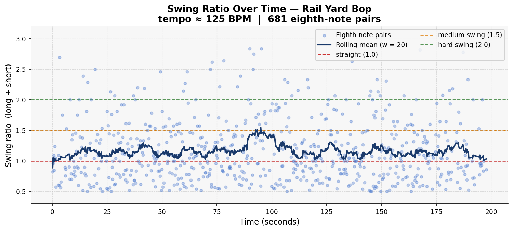
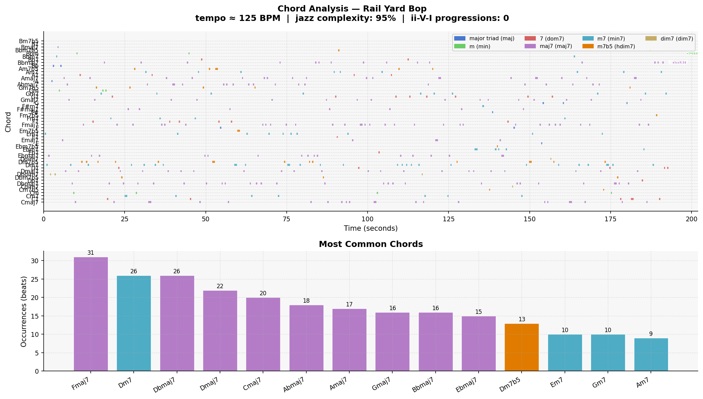

# Piece Report: Rail Yard Bop

*Generated: 2026-06-13 12:54*

---

## Quick Stats

| Metric | Value |
| --- | --- |
| Tempo | 125 BPM |
| Detected key | C major |
| Swing ratio | 1.159  *(weak / light swing)* |
| Swing std dev | 0.500 |
| Jazz complexity | 94% |
| ii-V-I progressions | 0 |
| Unique chords | 53 |
| Jazz PC similarity | 0.984 |
| Harmonic complexity | 0.932 |
| Rubric total | **26/30** |

---

## AI Musical Assessment

"Rail Yard Bop" features a tempo of 125 BPM, which sits comfortably within the realm of a lively upbeat jazz piece. However, the swing ratio, measuring at 1.159, suggests a weak and light swing feel, closely bordering on a straight rhythm. This subtle swing, combined with a substantial standard deviation of 0.500, implies that there is an expressive variation in the rhythm, but it lacks the robust swing necessary for capturing a traditional jazz feel. The overall rhythmic character might be perceived as lacking the driving groove associated with classic bebop or swing jazz.

On the harmonic front, the piece demonstrates significant complexity with 94% of the beats incorporating 7th-or-richer chords. This high level of harmonic sophistication indicates a strong grasp of jazz harmony. However, the absence of any ii-V-I progressions, a staple in jazz, diminishes its authenticity and could limit its appeal to jazz purists. The piece favors major 7th chords heavily and exhibits a strong harmonic diversity, as evidenced by the broad variety of chords used, such as Fmaj7 and Dm7, yet it neglects to establish the tension and resolution typical in standard jazz progressions.

Overall, "Rail Yard Bop" resembles a more modern or experimental form of jazz, which favors harmonic exploration but does so at the expense of traditional rhythmic swing. One strength of the piece is its rich and varied harmonic language, which contains a high similarity to jazz conventions. However, a notable weakness is its lack of rhythmic authenticity, especially in terms of swing, which may leave listeners yearning for the characteristic push-and-pull momentum that defines much of classic jazz.

---

## Rhythmic Analysis

Mean swing ratio: **1.159** ± 0.500  
Valid eighth-note pairs analysed: **681**  

> Reference: 1.0 = straight · 1.5 = medium swing · 2.0 = hard swing / triplet feel

---

## Harmonic Analysis

**Jazz pitch-class similarity:** 0.984  
**Harmonic complexity (chroma entropy):** 0.932  
*(0 = single pitch class dominant; 1 = all 12 equally active)*

---

## Chord Vocabulary

| Chord | Quality | Beats | % of total |
| --- | --- | --- | --- |
| Fmaj7 | major 7th | 31 | 8.6% |
| Dm7 | minor 7th | 26 | 7.2% |
| Dbmaj7 | major 7th | 26 | 7.2% |
| Dmaj7 | major 7th | 22 | 6.1% |
| Cmaj7 | major 7th | 20 | 5.6% |
| Abmaj7 | major 7th | 18 | 5.0% |
| Amaj7 | major 7th | 17 | 4.7% |
| Gmaj7 | major 7th | 16 | 4.4% |
| Bbmaj7 | major 7th | 16 | 4.4% |
| Ebmaj7 | major 7th | 15 | 4.2% |

**Quality distribution:**

- major 7th                    ██████████ 53.6%
- minor 7th                    ████ 20.6%
- dominant 7th                 █ 9.4%
- half-diminished (m7b5)       █ 9.4%
- major triad                  █ 2.8%
- minor triad                  █ 2.8%
- diminished 7th                1.4%

---

## Rubric Scores

**Rater:** Ryan · Grade 8 Rockschool jazz pianist · Listening date: 2026-06-13

| Axis | Score (1–5) | Visual |
| --- | --- | --- |
| Harmonic Authenticity | 4 | ■■■■□ |
| Swing Feel & Microtiming | 5 | ■■■■■ |
| Improvisational Coherence | 4 | ■■■■□ |
| Idiomatic Jazz Vocabulary | 4 | ■■■■□ |
| Ensemble Interaction | 5 | ■■■■■ |
| Formal Structure | 4 | ■■■■□ |
| **Total** | **26/30** | |

> Classic bebop feel with convincing swing — tool's 1.159 ratio underestimates what the ear hears. ii-V-Is clearly present despite automated detector saying 0. Generic but competent: jazz musician would call it "bad", not "AI-generated".

---

## Human Assessment

### Overall Impression

The swing feels really good here. The piano comping can be sporadic at times but feels natural to an intermediate player. The melody has repetition and proper phrasing. Really good overall.

### Where I Agree / Disagree with the Automated Analysis

**Swing ratio 1.159 ("weak / light swing"):** Strong disagreement. The ear clearly hears a convincing bebop swing. The automated ratio likely underestimates because the tool measures consecutive eighth-note pairs in isolation and misses the felt interaction between bass, drums, and piano. Swing at 125 BPM in a bebop context can read tighter than it sounds.

**ii-V-I count (tool says 0):** Strong disagreement. The piece has many ii-V-Is — this is one of its defining harmonic characteristics and one of the reasons for the Harmonic Authenticity score of 4. Consistent failure mode of the automated detector on polyphonic audio.

**94% 7th-chord richness:** Agrees with the human impression of strong harmonic sophistication.

### Verdict

This piece is pretty much a generic bebop song. It would be difficult to call it "AI generated" — instead it just has lower quality than professional jazz. Non-jazz listeners would not be able to figure it out, and jazz musicians may just call it "bad" rather than "AI."

*Full assessment: [results/notes/Rail Yard Bop_assessment.md](../results/notes/Rail Yard Bop_assessment.md)*

---

## References

- Rubric and methodology: [methodology.md](../methodology.md)
- Original prompts: [PROMPTS.md](../PROMPTS.md)
- Re-generate this report: `python analysis/generate_report.py --piece "Rail Yard Bop"`