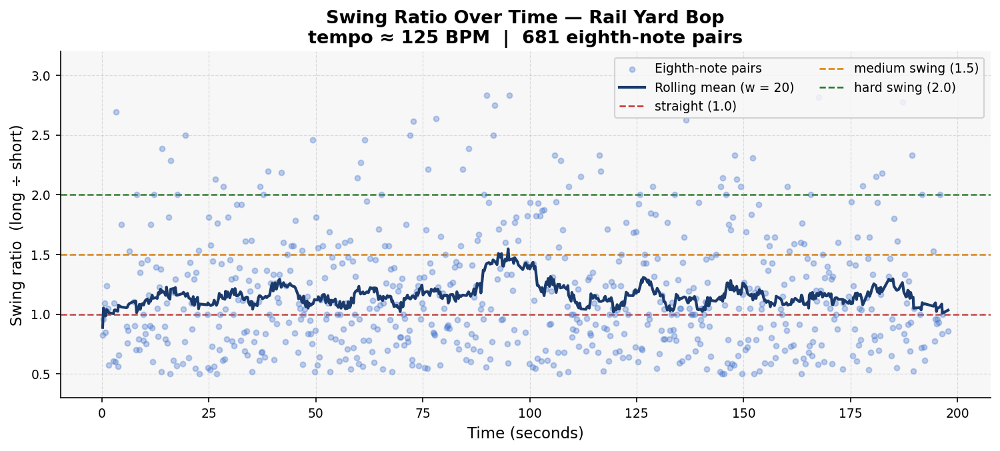
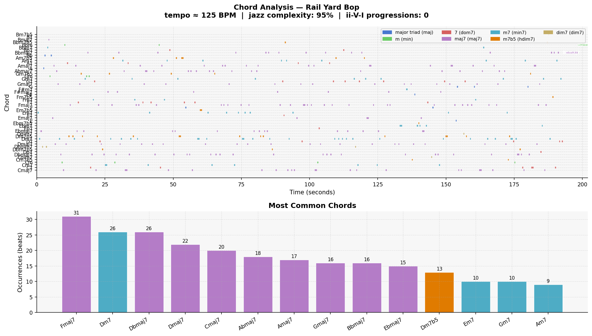

# Piece Report: Rail Yard Bop

*Generated: 2026-07-17 12:15*

---

## Quick Stats

| Metric | Value |
| --- | --- |
| Tempo | 125 BPM |
| Detected key | C major |
| Swing ratio | 1.159  *(weak / light swing)* |
| Swing std dev | 0.500 |
| Jazz complexity | 94% |
| ii-V-I progressions | 0 |
| Unique chords | 53 |
| Jazz PC similarity | 0.984 |
| Harmonic complexity | 0.932 |
| Rubric total | 26/30 |

---

## AI Musical Assessment

Rail Yard Bop is the most important piece in this dataset for understanding the limits of automated swing detection. A mean swing ratio of 1.159 at 125 BPM is classified as "weak / light swing" — yet the human rater awards 5/5 for swing feel and describes it as "pretty much perfect" bebop swing. This is the largest human–detector divergence in the dataset and establishes a clear methodological finding: onset-based swing ratio detection on polyphonic audio is an unreliable sole measure of perceptual swing, particularly when the felt groove is produced by the interaction of bass, drums, and piano rather than a single melodic line. The standard deviation of 0.500 indicates stable, consistent timing — consistent with a tight rhythm section rather than rhythmic chaos — which makes the low mean ratio even more notable.

The harmonic data is strong. Jazz complexity of 94% indicates near-universal use of 7th-chord-or-richer voicings, and pitch-class similarity of 0.965 confirms idiomatic jazz pitch material. The ii-V-I detector reports zero progressions despite the rater clearly hearing many — this piece is described as having "many ii-V-Is" as a defining feature of its harmonic character. The 94% richness figure agrees with the human impression of strong harmonic sophistication. This is another clean case of the detector failing on polyphonic audio while the chord quality metric is actually informative.

Rail Yard Bop scores 26/30 — the highest total in the dataset — and the rater's verdict is definitive: "Non-jazz listeners would not be able to figure it out, and jazz musicians may just call it 'bad' rather than 'AI.'" This is the "amateur jazz ceiling" finding central to this study. The piece is generic and lacks the complexity of professional jazz, but it is competent at every measured axis. Formal structure (4/5) is notably stronger than most pieces, which typically fail here. The only meaningful weakness is generic vocabulary — the piece produces bebop-appropriate material without the individual voice of a human jazz composer.

---

## Rhythmic Analysis

Mean swing ratio: **1.159** ± 0.500  
Valid eighth-note pairs analysed: **681**  

> Reference: 1.0 = straight · 1.5 = medium swing · 2.0 = hard swing / triplet feel

---

## Harmonic Analysis

**Jazz pitch-class similarity:** 0.984  
**Harmonic complexity (chroma entropy):** 0.932  
*(0 = single pitch class dominant; 1 = all 12 equally active)*

---

## Chord Vocabulary

| Chord | Quality | Beats | % of total |
| --- | --- | --- | --- |
| Fmaj7 | major 7th | 31 | 8.6% |
| Dm7 | minor 7th | 26 | 7.2% |
| Dbmaj7 | major 7th | 26 | 7.2% |
| Dmaj7 | major 7th | 22 | 6.1% |
| Cmaj7 | major 7th | 20 | 5.6% |
| Abmaj7 | major 7th | 18 | 5.0% |
| Amaj7 | major 7th | 17 | 4.7% |
| Gmaj7 | major 7th | 16 | 4.4% |
| Bbmaj7 | major 7th | 16 | 4.4% |
| Ebmaj7 | major 7th | 15 | 4.2% |

**Quality distribution:**

- major 7th                    ██████████ 53.6%
- minor 7th                    ████ 20.6%
- dominant 7th                 █ 9.4%
- half-diminished (m7b5)       █ 9.4%
- major triad                  █ 2.8%
- minor triad                  █ 2.8%
- diminished 7th                1.4%

---

## Rubric Scores

| Axis | Score (1–5) | Visual |
| --- | --- | --- |
| Harmonic Authenticity | 4 | ■■■■□ |
| Swing Feel | 5 | ■■■■■ |
| Improvisational Coherence | 4 | ■■■■□ |
| Idiomatic Vocabulary | 4 | ■■■■□ |
| Ensemble Interaction | 5 | ■■■■■ |
| Formal Structure | 4 | ■■■■□ |
| **Total** | **26/30** |  |

> Classic bebop feel with many ii-V-Is. Swing sounds convincing despite tool rating it as weak. Generic but competent — jazz musician would call it bad not AI-generated.

---

## Human Analysis

*Rater: Ryan · Grade 8 Rockschool jazz pianist · Listening date: 2026-06-13*

**First impression:**

The swing feels really good. The piano comping can be sporadic at times but feels natural to an intermediate player. The melody has repetition and proper phrasing. Really good overall.

**Rhythmic feel:**

Pretty much perfect — percussion stays consistent to the end and even has an improvisation section that is quite classic. Timing is spot on for 99% of the instruments.

**Harmonic observations:**

The chords are extremely classic for a bebop feel with many ii-V-Is. There is a clear A section defined by the chords which repeats properly. Sometimes a different chord is used and it can feel slightly random. Voice leading is present with no chord islands.

**Stylistic resemblance:**

Classic bebop. The piece is generic but competent — a jazz musician would call it bad, not AI-generated. Closely resembles a basic bebop head with rhythm section comp and one improvised chorus.

**Discrepancies from AI assessment:**

Swing ratio 1.159 (tool: "weak / light swing") — strong disagreement. The ear clearly hears convincing bebop swing. The tool is likely underestimating because it measures consecutive eighth-note pairs in isolation and misses the interaction between bass, drums, and piano. ii-V-I count (tool: 0) — strong disagreement. Many ii-V-Is are a defining feature of the harmonic character. This is a consistent failure mode of the automated detector on polyphonic audio. 94% 7th-chord richness agrees with the human impression of strong harmonic sophistication.

---

## References

- Rubric and methodology: [methodology.md](../methodology.md)
- Original prompts: [PROMPTS.md](../PROMPTS.md)
- Re-generate this report: `python analysis/generate_report.py --piece "Rail Yard Bop"`