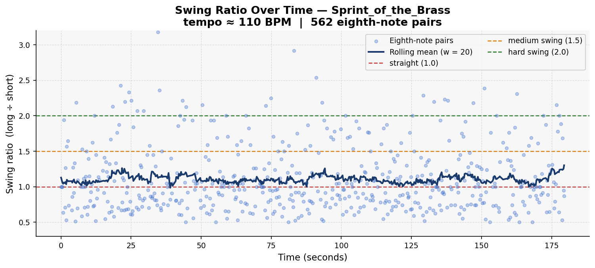
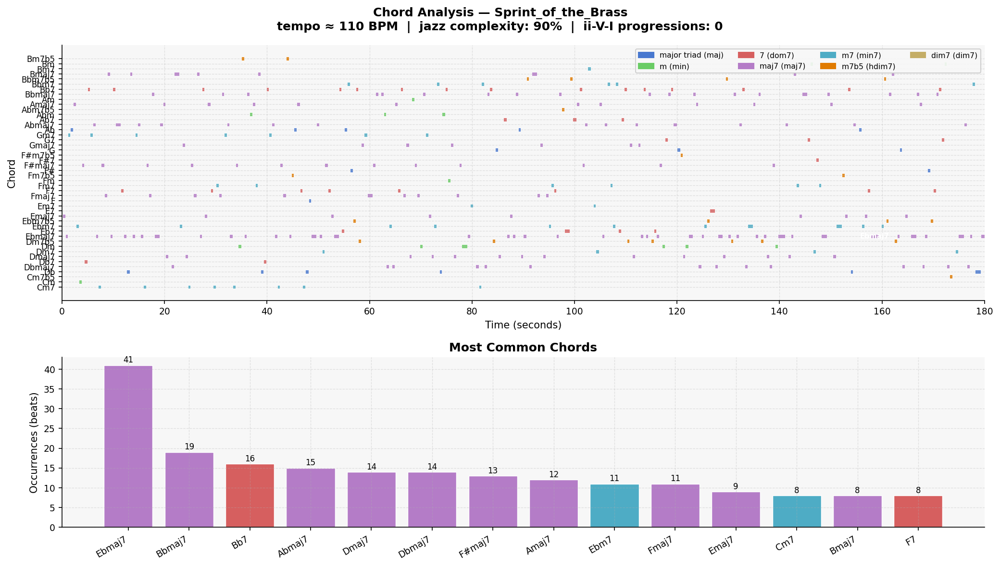

# Piece Report: Sprint_of_the_Brass

*Generated: 2026-07-16 15:47*

---

## Quick Stats

| Metric | Value |
| --- | --- |
| Tempo | 110 BPM |
| Detected key | Eb major |
| Swing ratio | 1.105  *(weak / light swing)* |
| Swing std dev | 0.449 |
| Jazz complexity | 90% |
| ii-V-I progressions | 0 |
| Unique chords | 46 |
| Jazz PC similarity | 0.941 |
| Harmonic complexity | 0.902 |
| Rubric total | 20/30 |

---

## AI Musical Assessment

Sprint of the Brass lands at 110 BPM with a swing ratio of 1.105 — the tool labels this "weak / light swing," but given the consistent pattern across this dataset (Corner Pocket Riff at 1.096 and Rail Yard Bop at 1.159 both receiving 5/5 human swing scores), this number should be treated with significant scepticism. The name and context suggest a brass-driven ensemble piece, and onset-based detection is particularly unreliable when swing is primarily carried by a rhythm section rather than a single melodic voice. The standard deviation of 0.449 indicates stable timing, which is consistent with a well-executed ensemble feel rather than rhythmic chaos.

The harmonic profile is strong. Jazz complexity of 90% means nine in ten beats feature a 7th chord or richer voicing — one of the higher figures in this dataset. The top chords (Ebmaj7, Bbmaj7, Bb7, Abmaj7, Dmaj7, Dbmaj7) show a heavy Eb major bias with flat-side dominance, typical of big-band arranging. The Bb7 (dominant of Eb) appearing in third place is the most harmonically functional chord in the top ten, suggesting at least some cadential motion is present even if the ii-V-I detector missed it. Forty-six unique chords is moderately high, and jazz pitch-class similarity of 0.941 is consistent with idiomatic jazz pitch usage.

Sprint of the Brass appears to be one of the more harmonically sophisticated pieces in the dataset — strong complexity, plausible chord types, a clear tonal centre in Eb, and a tempo and name consistent with a big-band or brass-section prompt. The swing ratio discrepancy is the most important unknown here: if the human rater hears convincing brass-section swing (as seems plausible from the other data), this could score comparably to Corner Pocket Riff. The key weakness to listen for is whether the 46 unique chords reflect genuine harmonic movement or random substitution — and whether the brass writing shows real section call-and-response or simply parallel motion.

---

## Rhythmic Analysis

Mean swing ratio: **1.105** ± 0.449  
Valid eighth-note pairs analysed: **562**  

> Reference: 1.0 = straight · 1.5 = medium swing · 2.0 = hard swing / triplet feel

---

## Harmonic Analysis

**Jazz pitch-class similarity:** 0.941  
**Harmonic complexity (chroma entropy):** 0.902  
*(0 = single pitch class dominant; 1 = all 12 equally active)*

---

## Chord Vocabulary

| Chord | Quality | Beats | % of total |
| --- | --- | --- | --- |
| Ebmaj7 | major 7th | 41 | 13.7% |
| Bbmaj7 | major 7th | 19 | 6.4% |
| Bb7 | dominant 7th | 16 | 5.4% |
| Abmaj7 | major 7th | 15 | 5.0% |
| Dmaj7 | major 7th | 14 | 4.7% |
| Dbmaj7 | major 7th | 14 | 4.7% |
| F#maj7 | major 7th | 13 | 4.3% |
| Amaj7 | major 7th | 12 | 4.0% |
| Ebm7 | minor 7th | 11 | 3.7% |
| Fmaj7 | major 7th | 11 | 3.7% |

**Quality distribution:**

- major 7th                    ██████████ 54.5%
- minor 7th                    ███ 15.1%
- dominant 7th                 ██ 12.7%
- half-diminished (m7b5)       █ 7.4%
- major triad                  █ 5.7%
- minor triad                  █ 4.7%

---

## Rubric Scores

| Axis | Score (1–5) | Visual |
| --- | --- | --- |
| Harmonic Authenticity | 2 | ■■□□□ |
| Swing Feel | 3 | ■■■□□ |
| Improvisational Coherence | 4 | ■■■■□ |
| Idiomatic Vocabulary | 5 | ■■■■■ |
| Ensemble Interaction | 4 | ■■■■□ |
| Formal Structure | 2 | ■■□□□ |
| **Total** | **20/30** |  |

> Good solos (xylophone at 1:53 — 5/5 vocabulary). Swing too relaxed for bebop. No clear melody or harmonic progression. Abrupt ending at 3:00. Micro-coherence excellent; macro-coherence poor.

---

## Human Analysis

*Rater: Ryan · Grade 8 Rockschool jazz pianist · Listening date: 2026-06-13 · Times listened: 12*

**First impression:**

Near-perfect swing. Slight repetition issue with no clear melody, but ensemble interaction is really good and timbre is proper for the style.

**Rhythmic feel:**

The swing isn't extreme but feels quite good and relaxing. The rhythm is consistent throughout with the percussion continuously having a proper feel and good fills. It just doesn't have a true swing/bebop feel — too relaxed for the style.

**Harmonic observations:**

The chords make sense but can sometimes be wrong and out of place. There is no visible proper progression at all. The solo at 0:57 uses proper phrasing and melodic patterns. The xylophone solo at 1:53 is a standout — extremely good vocabulary with proper phrasing, chromatic slides, and melodic patterns with repetition and variation.

**Stylistic resemblance:**

Bebop-adjacent, though the relaxed swing feel pushes it closer to a cool jazz or light swing feel than true bebop. The xylophone is an unusual instrument choice for this style.

**Discrepancies from AI assessment:**

The tool rates swing at 1.105 ("weak / light swing") which aligns more closely with the human impression than previous pieces — the swing here is genuinely relaxed rather than strong. The AI assessment predicted this could score comparably to Corner Pocket Riff; the actual formal structure (2/5, abrupt ending at 3:00) and harmonic coherence (2/5) pull the total below that prediction. The xylophone solo — the highest-scoring individual element — is something the quantitative data cannot detect.

---

## References

- Rubric and methodology: [methodology.md](../methodology.md)
- Original prompts: [PROMPTS.md](../PROMPTS.md)
- Re-generate this report: `python analysis/generate_report.py --piece "Sprint_of_the_Brass"`