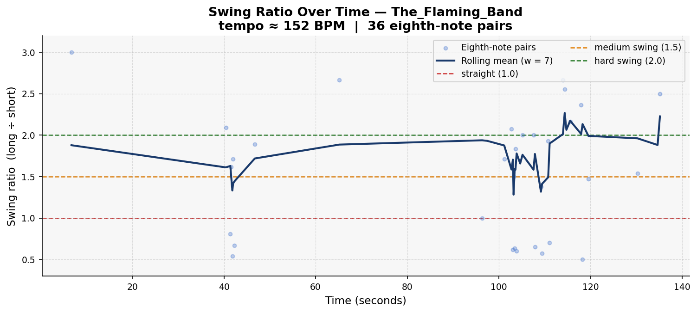
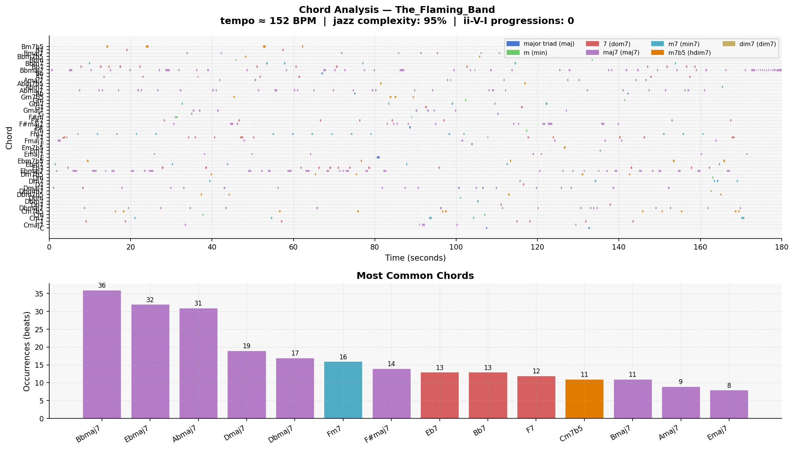

# Piece Report: The_Flaming_Band

*Generated: 2026-07-16 15:42*

---

## Quick Stats

| Metric | Value |
| --- | --- |
| Tempo | 152 BPM |
| Detected key | Bb major |
| Swing ratio | 1.786  *(strong swing)* |
| Swing std dev | 0.950 |
| Jazz complexity | 94% |
| ii-V-I progressions | 0 |
| Unique chords | 55 |
| Jazz PC similarity | 0.961 |
| Harmonic complexity | 0.917 |
| Rubric total | 17/30 |

---

## AI Musical Assessment

The Flaming Band is the fastest piece in this dataset at 152 BPM, with a swing ratio of 1.786 — classified as strong swing and the highest ratio recorded from a plausible polyphonic measurement. However, this figure comes with a critical caveat: only 36 valid onset pairs were detected, by far the fewest in the dataset. At 152 BPM with a dense ensemble texture, the onset detector struggles to isolate individual eighth-note pairs reliably from a polyphonic signal. The standard deviation of 0.950 is the highest in the dataset, reflecting either genuine rhythmic expressiveness or — more likely given the low pair count — high noise in the measurement. This swing ratio should be treated as the least reliable in the dataset and given particularly low weight relative to human assessment.

The harmonic data is more informative. Jazz complexity of 95% is among the highest recorded, and pitch-class similarity of 0.961 confirms idiomatic jazz pitch usage. The top chords (Bbmaj7, Ebmaj7, Abmaj7, Dmaj7, Dbmaj7, Fm7, F#maj7, Eb7, Bb7, F7) show a Bb major tonal centre with a clear flat-side orientation. The Eb7 and Bb7 suggest some dominant function motion, and Fm7 (the ii of Eb, or v of Bb) appearing in sixth place offers a glimpse of functional voice leading even if the ii-V-I detector found none. Fifty-five unique chords is the highest count in the dataset, which at this tempo could reflect rapid harmonic rhythm or, again, the detector miscounting at high tempo.

The Flaming Band presents the most data-uncertainty of any piece in this evaluation. The swing ratio and chord count are both potentially inflated by the speed and density of the ensemble texture, making human assessment particularly important here. What the data does confirm is strong jazz harmonic vocabulary at a high tempo — the question is whether it holds together rhythmically and formally. A human ear at 152 BPM will quickly identify whether this is a convincing fast-swing ensemble or a dense, incoherent blur.

---

## Rhythmic Analysis

Mean swing ratio: **1.786** ± 0.950  
Valid eighth-note pairs analysed: **36**  

> Reference: 1.0 = straight · 1.5 = medium swing · 2.0 = hard swing / triplet feel

---

## Harmonic Analysis

**Jazz pitch-class similarity:** 0.961  
**Harmonic complexity (chroma entropy):** 0.917  
*(0 = single pitch class dominant; 1 = all 12 equally active)*

---

## Chord Vocabulary

| Chord | Quality | Beats | % of total |
| --- | --- | --- | --- |
| Bbmaj7 | major 7th | 36 | 9.6% |
| Ebmaj7 | major 7th | 32 | 8.5% |
| Abmaj7 | major 7th | 31 | 8.3% |
| Dmaj7 | major 7th | 19 | 5.1% |
| Dbmaj7 | major 7th | 17 | 4.5% |
| Fm7 | minor 7th | 16 | 4.3% |
| F#maj7 | major 7th | 14 | 3.7% |
| Eb7 | dominant 7th | 13 | 3.5% |
| Bb7 | dominant 7th | 13 | 3.5% |
| F7 | dominant 7th | 12 | 3.2% |

**Quality distribution:**

- major 7th                    ██████████ 52.5%
- dominant 7th                 ███ 17.9%
- minor 7th                    ██ 12.5%
- half-diminished (m7b5)       ██ 11.2%
- minor triad                  █ 2.9%
- major triad                  █ 2.7%
- diminished 7th                0.3%

---

## Rubric Scores

| Axis | Score (1–5) | Visual |
| --- | --- | --- |
| Harmonic Authenticity | 3 | ■■■□□ |
| Swing Feel | 2 | ■■□□□ |
| Improvisational Coherence | 3 | ■■■□□ |
| Idiomatic Vocabulary | 2 | ■■□□□ |
| Ensemble Interaction | 4 | ■■■■□ |
| Formal Structure | 3 | ■■■□□ |
| **Total** | **17/30** |  |

> Brass head feels incorrect — phantom harmonics work but no functional ii-V-Is. Swing collapses at 2:45. Piano solo coherent; brass sections not. Call-and-response the strongest axis. Too random and aimless — detectable by casual listeners and definitive for jazz musicians.

---

## Human Analysis

*Rater: Ryan · Grade 8 Rockschool jazz pianist · Rated blind: yes · Listening date: 2026-06-13 · Times listened: 9*

**First impression:**

Chords fit the tonal/modal intricacies of jazz. Some repetition of chord progressions defines clear sections, but there are moments where it drifts into new/random territories. Clear sectioning of the different parts, timbre satisfactory. Micro-analysis is good in short bursts, but across the full piece there are inconsistencies with style, swing, chords, and sectioning. At 1:34 the piece shifts from open modal jazz toward a more classic swing feel.

**Rhythmic feel:**

Swing is inconsistent — sometimes extremely good at being micro-coherent, sometimes lacking clear melody. The piano sections are much better than the brass sections in this regard. The ending near 2:45 completely breaks down. As it is mostly alright during the head and solo it gets a 2 — the collapse in the final section is the deciding factor.

**Harmonic observations:**

There is a phantom sense of Bb7→G7→Cm7→F7, but no chord progression is actually felt — the brass head creates harmonic colour that works in isolation without building to anything. No well-defined ii-V-Is can be found despite the chord data showing Fm7 (potential ii of Eb) and Bb7/Eb7 (dominant motion). The detector agrees with the human here for once: 0 ii-V-I progressions detected, and 0 heard.

**Stylistic resemblance:**

Fast big-band swing attempted — the brass ensemble texture and 152 BPM tempo point toward something like a Count Basie or Maynard Ferguson–style piece. The brass melody execution prevents it from landing in any specific substyle convincingly.

**Discrepancies from AI assessment:**

The AI assessment correctly warned that the swing ratio (1.786 from only 36 pairs) was the least reliable in the dataset and should be given low weight relative to human assessment. Confirmed: human gives 2/5 swing. The collapse at 2:45 is the clearest evidence — no onset detector with 36 pairs could capture this. The AI also predicted ensemble interaction as the key listening test; ensemble interaction is indeed the strongest axis (4/5), the one finding the automated analysis could not anticipate. The AI's identification of the brass texture and Bb major tonal centre is accurate.

---

## References

- Rubric and methodology: [methodology.md](../methodology.md)
- Original prompts: [PROMPTS.md](../PROMPTS.md)
- Re-generate this report: `python analysis/generate_report.py --piece "The_Flaming_Band"`