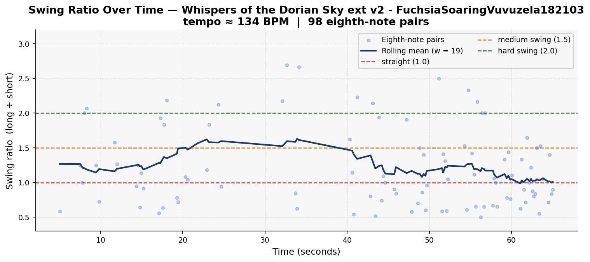
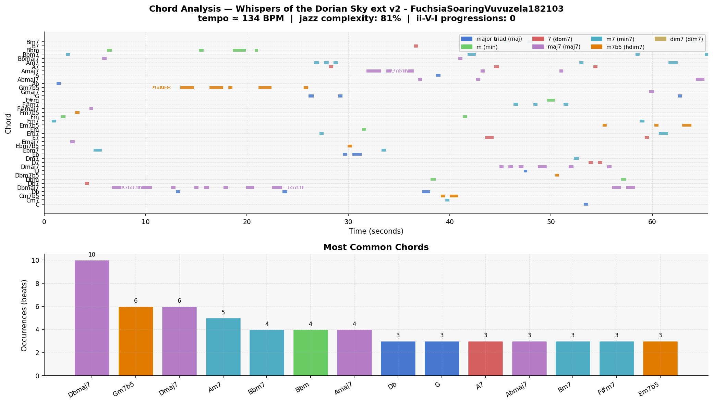

# Piece Report: Whispers of the Dorian Sky ext v2 - FuchsiaSoaringVuvuzela182103

*Generated: 2026-07-17 12:15*

---

## Quick Stats

| Metric | Value |
| --- | --- |
| Tempo | 134 BPM |
| Detected key | C# minor |
| Swing ratio | 1.225  *(weak / light swing)* |
| Swing std dev | 0.617 |
| Jazz complexity | 77% |
| ii-V-I progressions | 0 |
| Unique chords | 40 |
| Jazz PC similarity | 0.948 |
| Harmonic complexity | 0.859 |
| Rubric total | 10/30 |

---

## AI Musical Assessment

The rhythmic profile of this piece is immediately at odds with its stated intent. A modal jazz piece in the Kind of Blue tradition should breathe at 60–75 BPM with brushed drums and deliberate space; the detected tempo is 134 BPM — nearly double that — and the swing ratio of 1.225 places it in "weak/light swing" territory, with a standard deviation of 0.617 that reflects genuine rhythmic instability rather than expressive rubato. The high variance is diagnostic: the human rater identifies the swing collapsing entirely at 0:32, suggesting the model cannot sustain even its modest initial rhythmic commitment. The percussion tracking a different feel from the melodic instruments compounds this — a problem of ensemble-level coordination that onset detection alone cannot capture, but that is immediately audible to any listener.

The harmonic data tells a contradictory story. A jazz pitch-class similarity of 0.948 and 77% jazz complexity suggest sophisticated vocabulary on paper — and the quality breakdown confirms this: major 7ths (29%), minor 7ths (24%), and half-diminished chords (15%) dominate, which is broadly modal-jazz-appropriate. However, 40 unique chords across a short piece, a chroma entropy of 0.859, and zero detected ii-V-I progressions paint a different picture: the model is not working within a stable modal framework, it is cycling through every available extended chord with no tonal anchor. The top chords — Dbmaj7, Dmaj7, Amaj7, Gm7b5, Am7 — span multiple key centres with no resolution logic, and the chroma entropy figure confirms that all twelve pitch classes are nearly equally active. Modal jazz should show the opposite: low entropy, strong pitch-class dominance in the governing mode.

The overall verdict is that this piece represents the clearest failure mode in this dataset. The model has absorbed the surface vocabulary of modal jazz — the extended chords, the solo-instrument melody, the sparse texture — but has no understanding of what modal jazz actually does: sustain a single tonal colour over time, resist cadential resolution, and allow silence to function as music. Where Rail Yard Bop might fool a non-specialist as "bad jazz," this piece would not fool anyone listening past the first phrase. Specific weakness: total absence of modal stasis. Specific strength: the opening 30 seconds demonstrate that the model can briefly assemble convincing modal textures — it simply cannot sustain them.

---

## Rhythmic Analysis

Mean swing ratio: **1.225** ± 0.617  
Valid eighth-note pairs analysed: **98**  

> Reference: 1.0 = straight · 1.5 = medium swing · 2.0 = hard swing / triplet feel

---

## Harmonic Analysis

**Jazz pitch-class similarity:** 0.948  
**Harmonic complexity (chroma entropy):** 0.859  
*(0 = single pitch class dominant; 1 = all 12 equally active)*

---

## Chord Vocabulary

| Chord | Quality | Beats | % of total |
| --- | --- | --- | --- |
| Dbmaj7 | major 7th | 10 | 10.4% |
| Gm7b5 | half-diminished (m7b5) | 6 | 6.2% |
| Dmaj7 | major 7th | 6 | 6.2% |
| Am7 | minor 7th | 5 | 5.2% |
| Bbm7 | minor 7th | 4 | 4.2% |
| Bbm | minor triad | 4 | 4.2% |
| Amaj7 | major 7th | 4 | 4.2% |
| Db | major triad | 3 | 3.1% |
| G | major triad | 3 | 3.1% |
| A7 | dominant 7th | 3 | 3.1% |

**Quality distribution:**

- major 7th                    █████ 29.2%
- minor 7th                    ████ 24.0%
- half-diminished (m7b5)       ██ 14.6%
- major triad                  ██ 12.5%
- minor triad                  ██ 10.4%
- dominant 7th                 █ 9.4%

---

## Rubric Scores

| Axis | Score (1–5) | Visual |
| --- | --- | --- |
| Harmonic Authenticity | 2 | ■■□□□ |
| Swing Feel | 2 | ■■□□□ |
| Improvisational Coherence | 1 | ■□□□□ |
| Idiomatic Vocabulary | 2 | ■■□□□ |
| Ensemble Interaction | 2 | ■■□□□ |
| Formal Structure | 1 | ■□□□□ |
| **Total** | **10/30** |  |

> Starts fine but devolves into chaos. Swing breaks at 0:32; random chords at 0:47; incoherent fast runs at 0:55. Percussion doesn't follow same swing. Zero repetition or formal structure.

---

## Human Analysis

*Rater: Ryan · Grade 8 Rockschool jazz pianist · Listening date: 2026-06-13*

**First impression:**

The chords have proper extensions. The melody is simple but effective. However, as the song progresses, the coherence of the overall ensemble falls extremely quickly — till the end where it doesn't really make any sense.

**Rhythmic feel:**

Swing starts consistent but completely falls apart at 0:32. The percussion doesn't follow the same swing that the rest of the music is following.

**Harmonic observations:**

Simple chord extensions from the start with fine melody. The chords start to wander, but somehow feel fine to the untrained ear. At 0:47 it goes in a completely different direction with random chords. The random melodies do have chromatic tones and classic jazz phrasing — they just don't fit the slow, modal context.

**Stylistic resemblance:**

Attempted modal jazz (Kind of Blue style) that fails to sustain the style. The opening 30 seconds are the only section that resembles its target; thereafter it becomes unclassifiable.

**Discrepancies from AI assessment:**

The AI assessment correctly identified that 134 BPM is too fast for modal jazz and that the chroma entropy of 0.859 contradicts modal stasis. Both findings are confirmed by the human rating. The assessment also predicted the piece could briefly assemble convincing modal textures — confirmed: the first 30 seconds are acceptable. The collapse timeline matches: swing breaks at 0:32, random chords at 0:47, incoherent runs at 0:55.

---

## References

- Rubric and methodology: [methodology.md](../methodology.md)
- Original prompts: [PROMPTS.md](../PROMPTS.md)
- Re-generate this report: `python analysis/generate_report.py --piece "Whispers of the Dorian Sky ext v2 - FuchsiaSoaringVuvuzela182103"`