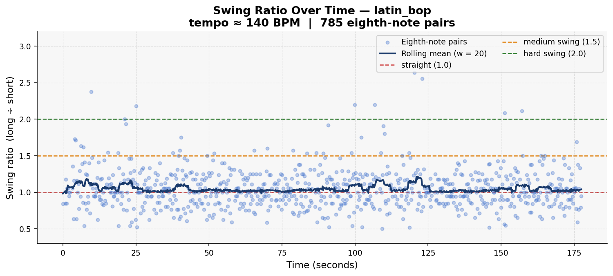
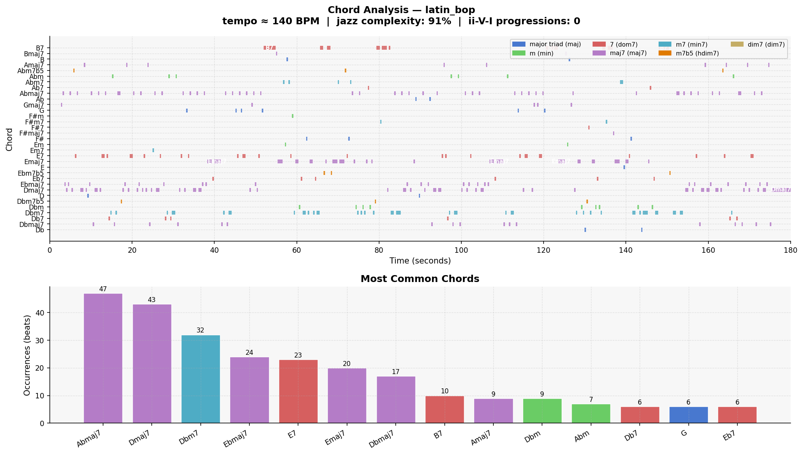

# Piece Report: latin_bop

*Generated: 2026-07-16 15:46*

---

## Quick Stats

| Metric | Value |
| --- | --- |
| Tempo | 140 BPM |
| Detected key | C# minor |
| Swing ratio | 1.047  *(essentially straight — no swing feel)* |
| Swing std dev | 0.268 |
| Jazz complexity | 88% |
| ii-V-I progressions | 0 |
| Unique chords | 33 |
| Jazz PC similarity | 0.913 |
| Harmonic complexity | 0.915 |
| Rubric total | 17/30 |

---

## AI Musical Assessment

Latin Bop records the lowest swing ratio in the entire dataset at 1.047 — essentially straight — and this is the one piece where that number is not a failure. Latin jazz (bossa nova, Afro-Cuban, mambo) is built on straight eighth notes and clave-based rhythmic patterns, not swing microtiming. A swing ratio close to 1.0 is the correct rhythmic character for this style; the onset detector is measuring the right thing for once, and finding the expected answer. Crucially, this measurement comes from 785 valid pairs — the second-highest count in the dataset — making it the most statistically reliable swing ratio recorded. The standard deviation of 0.268 is also the lowest, confirming highly consistent timing, consistent with a locked-in Latin groove rather than expressive rubato.

The harmonic profile is solidly jazz. Jazz complexity of 88% and pitch-class similarity of 0.913 are both strong, and 33 unique chords is the most restrained count among the new pieces — a positive sign for harmonic coherence. The top chords (Abmaj7, Dmaj7, Dbm7, Ebmaj7, E7, Emaj7, Dbmaj7, B7) suggest a dense chromatic world centered around Db/C# with tritone-related chords (Ab and D, Db and G) appearing prominently — a common feature of modern Latin jazz voicings and consistent with the Afro-Cuban harmonic vocabulary. The detected key of C# minor is plausible. Zero detected ii-V-I progressions continues the detector's trend.

Latin Bop is the piece where the quantitative data is most interpretively clear. The near-straight swing ratio is a feature, the stable timing is a strength, and the jazz harmonic vocabulary is present and more focused than most other pieces. The critical question for the human rater is whether the Latin rhythmic feel — clave pattern, percussion texture, montuno piano or bossa guitar pattern — is actually present and idiomatic, or whether this is generic straight-eighth jazz with a Latin label. The harmony supports the prompt; the rhythm will confirm or deny it.

---

## Rhythmic Analysis

Mean swing ratio: **1.047** ± 0.268  
Valid eighth-note pairs analysed: **785**  

> Reference: 1.0 = straight · 1.5 = medium swing · 2.0 = hard swing / triplet feel

---

## Harmonic Analysis

**Jazz pitch-class similarity:** 0.913  
**Harmonic complexity (chroma entropy):** 0.915  
*(0 = single pitch class dominant; 1 = all 12 equally active)*

---

## Chord Vocabulary

| Chord | Quality | Beats | % of total |
| --- | --- | --- | --- |
| Abmaj7 | major 7th | 47 | 15.5% |
| Dmaj7 | major 7th | 43 | 14.2% |
| Dbm7 | minor 7th | 32 | 10.6% |
| Ebmaj7 | major 7th | 24 | 7.9% |
| E7 | dominant 7th | 23 | 7.6% |
| Emaj7 | major 7th | 20 | 6.6% |
| Dbmaj7 | major 7th | 17 | 5.6% |
| B7 | dominant 7th | 10 | 3.3% |
| Amaj7 | major 7th | 9 | 3.0% |
| Dbm | minor triad | 9 | 3.0% |

**Quality distribution:**

- major 7th                    ███████████ 55.8%
- dominant 7th                 ███ 15.8%
- minor 7th                    ██ 13.2%
- minor triad                  █ 6.3%
- major triad                  █ 5.9%
- half-diminished (m7b5)       █ 3.0%

---

## Rubric Scores

| Axis | Score (1–5) | Visual |
| --- | --- | --- |
| Harmonic Authenticity | 3 | ■■■□□ |
| Swing Feel | 3 | ■■■□□ |
| Improvisational Coherence | 2 | ■■□□□ |
| Idiomatic Vocabulary | 3 | ■■■□□ |
| Ensemble Interaction | 4 | ■■■■□ |
| Formal Structure | 2 | ■■□□□ |
| **Total** | **17/30** |  |

> Doesn't encapsulate true Latin feel. Clave not convincing or developed. No solo. Repetitive and generic but follows jazz rules. Ensemble interaction good but no call-and-response.

---

## Human Analysis

*Rater: Ryan · Grade 8 Rockschool jazz pianist · Listening date: 2026-06-13 · Times listened: 12*

**First impression:**

Doesn't really encapsulate the true Latin feeling, but elements do exist. Repetitive and generic but does properly follow jazz rules of melody, harmony, and interaction.

**Rhythmic feel:**

The swing feels quite good for an untrained listener. However, the clave is not properly developed and doesn't feel like a real clave. The rhythm doesn't play around with the clave either, leaving it quite basic.

**Harmonic observations:**

The chords make a decent level of sense, although repetitive. Chords don't really stand out or create strong harmonic progression. The melody is in style for the harmonic context with chromatic and proper melodic movement.

**Stylistic resemblance:**

Generic Latin jazz. Neither bossa nova nor Afro-Cuban is clearly executed — the clave inauthenticity prevents it from landing convincingly in either substyle.

**Discrepancies from AI assessment:**

The tool's near-straight swing ratio (1.047) is correctly interpreted as appropriate for Latin jazz, which aligns with the human assessment. However, the human ear identifies the clave as the critical failure — something the onset detector cannot measure at all. The quantitative data cannot distinguish between "correct straight-eighth Latin groove" and "straight-eighth jazz that forgot the clave."

---

## References

- Rubric and methodology: [methodology.md](../methodology.md)
- Original prompts: [PROMPTS.md](../PROMPTS.md)
- Re-generate this report: `python analysis/generate_report.py --piece "latin_bop"`